# MYSQL Windows

- [Descarga de MySQL para Windows](#id1)

- [Instalación de MySQL](#id2)

    - [Problema y solución en la instalación](#id3)

    - [Entramos en una Línea de comando](#id4)

    - [Ruta de Instalación MySQL Windows](#id5)

    - [Comprobación del Servicio de MySQL en Windows](#id6)

- [Instalación Workbench en Windows clientes](#id7)

- [Crear Usuarios desde línea comando](#id9)

    - [Permisos de Usuarios](#id10)
    

- [Comprobación que la Página Web se pueda visualizar](#id6)

## Descarga de MySQL para Windows
Tenemos que ir a la página de MySQL y nos descargamos del siguiente [MySQL](https://dev.mysql.com/downloads/windows/installer/5.7.html).

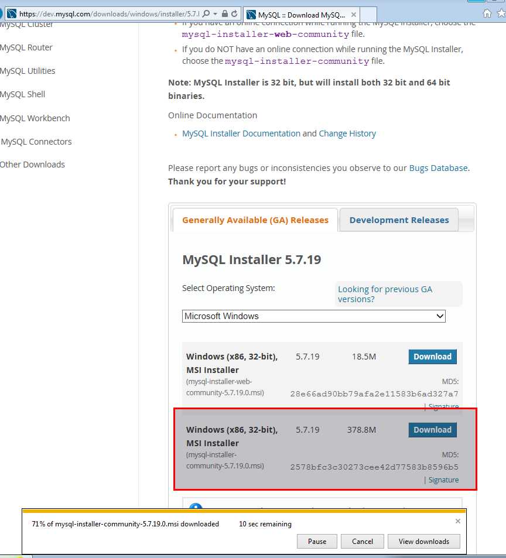

## Instalación de MySQL
Ejecutamos el msi que se descargo y solo debemos seguir el asistente de MySQL.

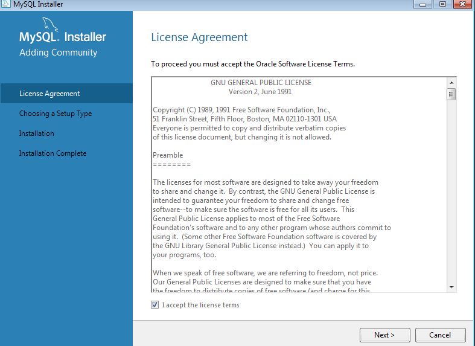

Le damos siguiente.

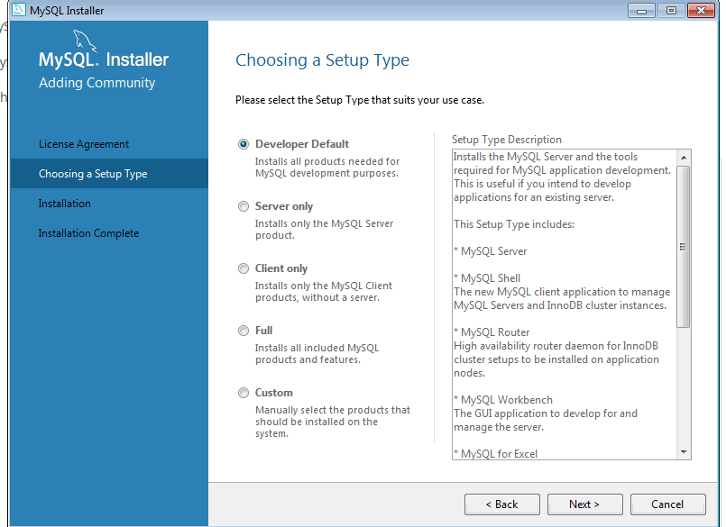

Seleccionamos developer default, es el por defecto de la instalación.

Tenemos que darle a ejecutar. El sistema comprobara si necesitas algún paquete especial para instalar.

### Problema y solución en la instalación MySQL

 > Si el proceso de instalación falla en este paso, tenemos que ir a la siguiente página para instalar el [Visual C++ 2015](https://www.microsoft.com/es-es/download/details.aspx?id=52685)

Seguimos con la instalación de MySQL.

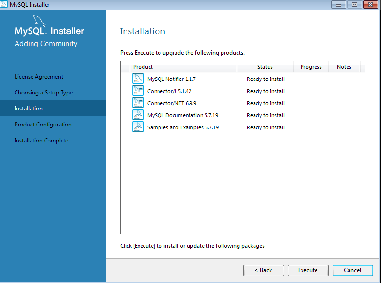

Le damos Execute, para realizar la instalación.

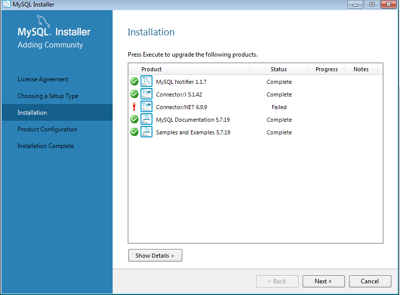

Le damos siguiente.

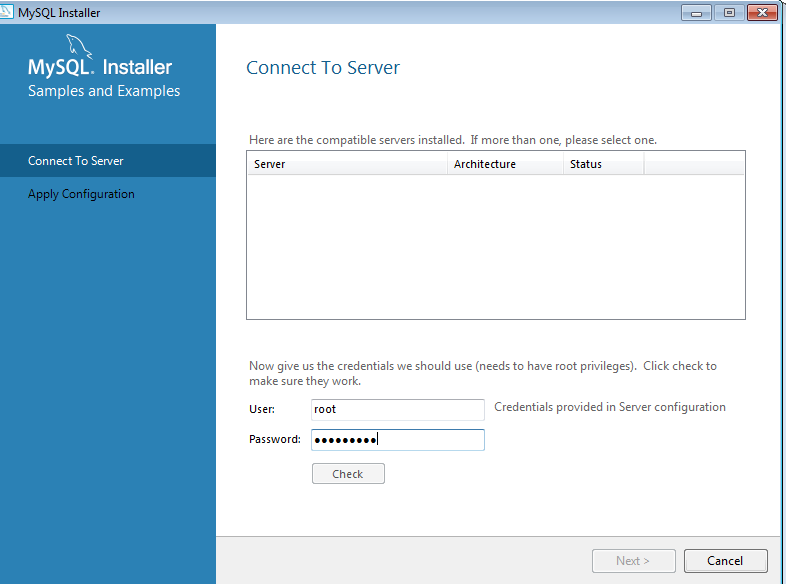

Escribimos el usuario root con la contraseña.

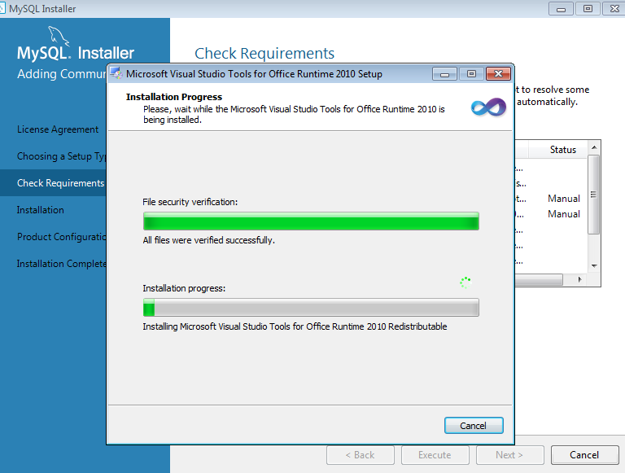

Se comprueba que se instalo todos los paquetes necesarios.

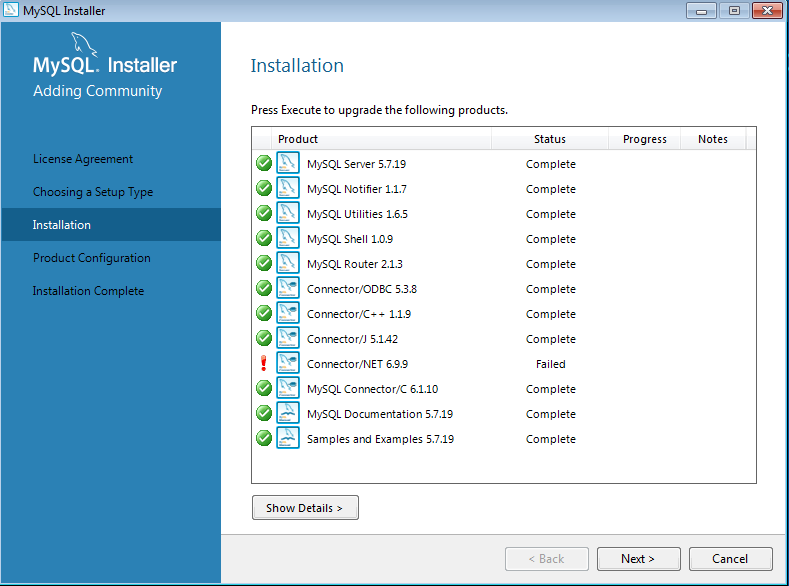

En un momento de la instalación nos pedirá la contraseña de root.

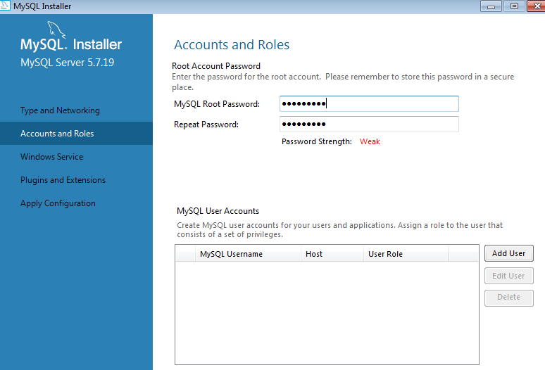

Seguimos y dejamos todo por defecto hasta llegar a la última ventana de la instalación.

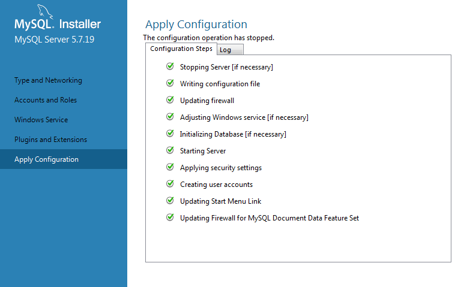

### Entramos en una Línea de comando.

Comprobamos que podamos acceder a la base de datos por defecto de MySQL.

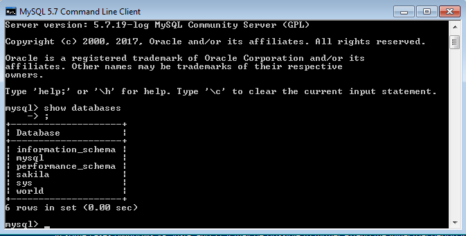

### Ruta de Instalación MySQL Windows 

Tenemos que ir a archivos de programas de windows y la carpeta mysql.

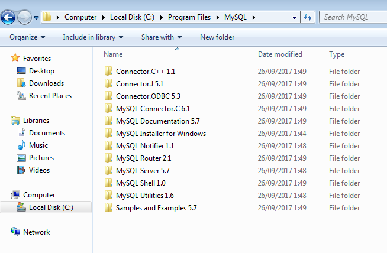

Entramos en MySQL Server 5.7 y comprobamos sus ficheros.

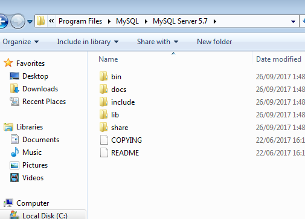

Entramos en la carpeta bin

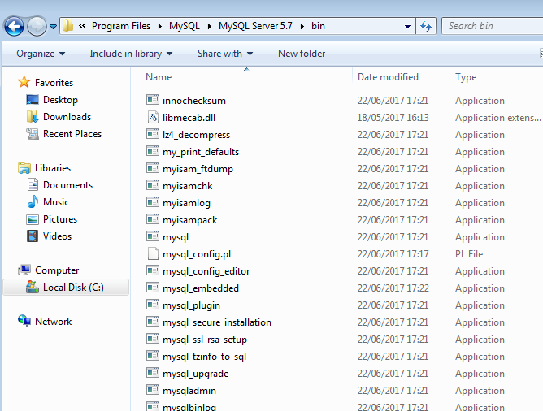

### Comprobación del Servicio de MySQL en Windows.

Escribimos services y comprobamos los servicios activados.

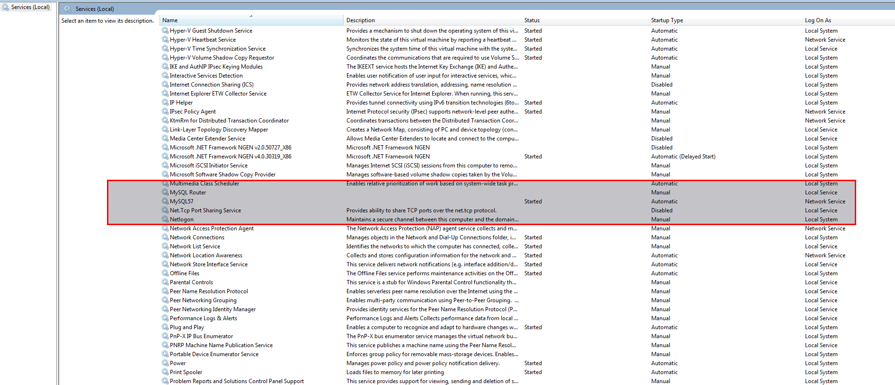

Para comprobar que el servicio esta iniciado por comando sería. net start

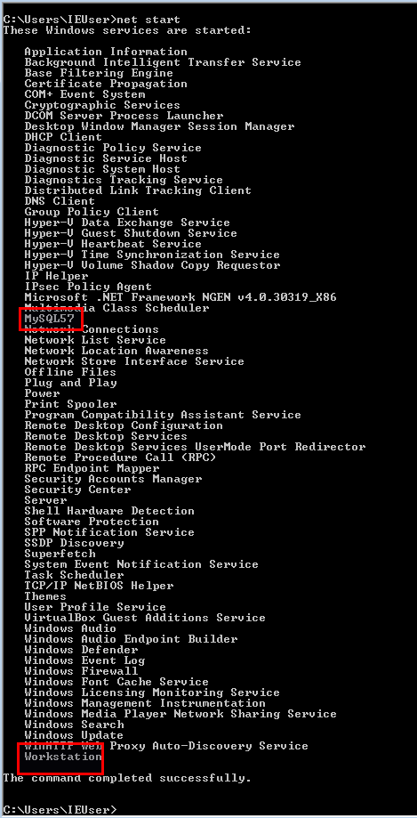

## Instalación Workbench en Windows clientes

Tenemos que instalar el Workbench en Windows 7 cliente para poder acceder al servidor de MySQL. Tenemos que descargar desde [MySQL](https://dev.mysql.com/downloads/windows/installer/5.7.html).

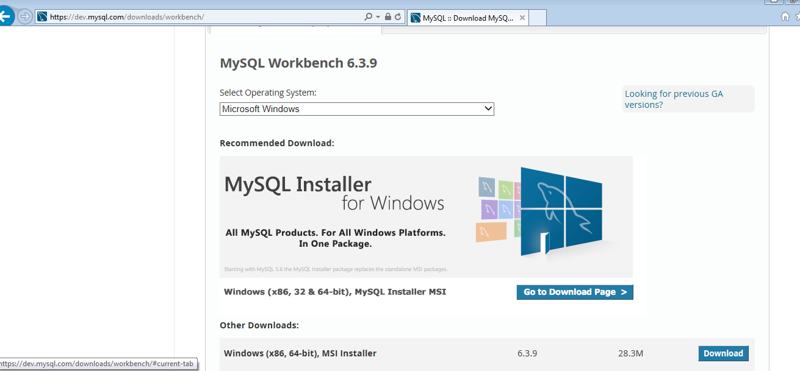

Solo tenemos que ejecutar el msi, seguir el asistente.

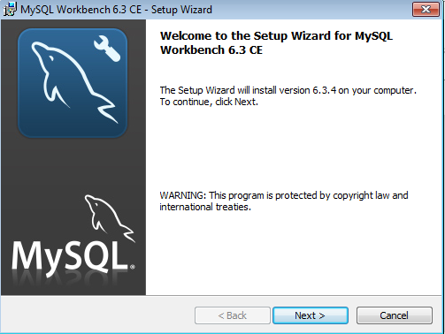

Solo tenemos que seguir el asistente todo siguiente y dejar todo por defecto en la instalación.

### Conectarse con el Workbench Cliente al servidor

Tenemos que abrir el Workbench y configurar la siguiente ruta.

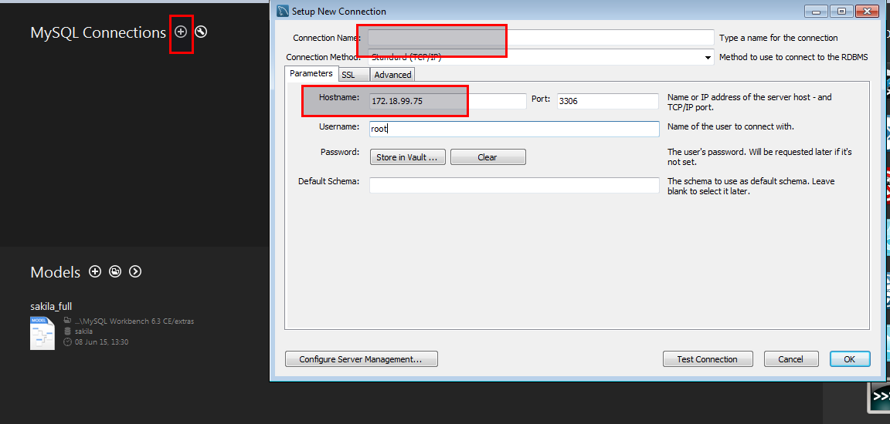

## Crear Usuarios desde línea comando

Creamos el usuario desde línea de comando.

si queremos crear un usuario desde Workbench podemos copiar el mismo comando de la línea de comando.

### Permisos de Usuarios 

Tenemos que escribir el siguiente comando.

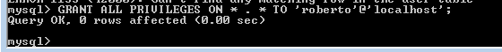

Esto significa que le da permiso total, pero no llega al mismo nivel que el usuario root de privilegios.

Para que todo se aplique debemos utilizar el siguiente comando.

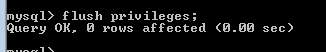
