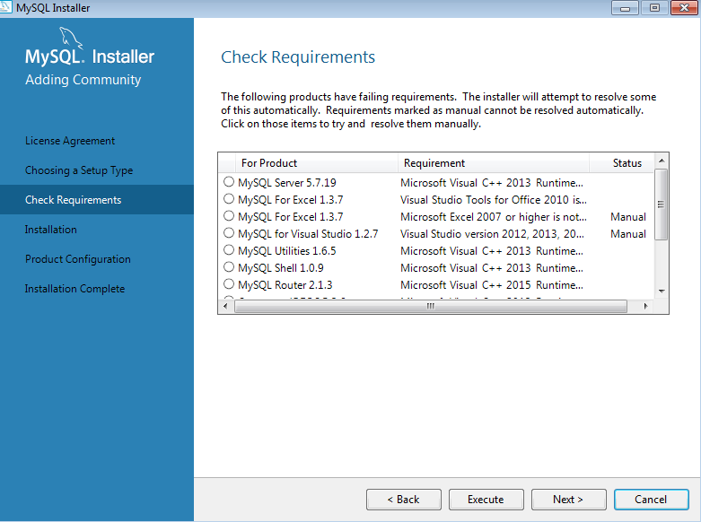
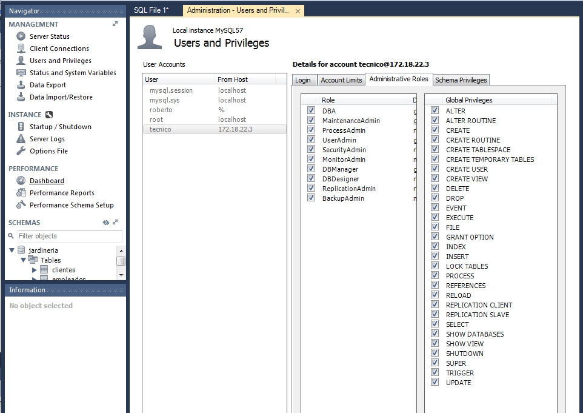
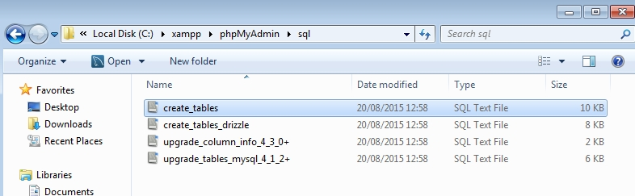

# MYSQL Windows

- [Descarga de MySQL para Windows](#id1)

- [Instalación de MySQL](#id2)

    - [Problema y solución en la instalación](#id3)

    - [Entramos en una Línea de comando](#id4)

    - [Ruta de Instalación MySQL Windows](#id5)

    - [Comprobación del Servicio de MySQL en Windows](#id6)

- [Instalación Workbench en Windows clientes](#id7)

- [Crear Usuarios desde línea comando](#id9)

- [Crear Usuarios desde Workbench](#id12)

    - [Permisos de Usuarios](#id10)

    - [Permisos de Usuarios desde Workbench](#id11)

- [Instalación del XAMP](#id13)

- [Configuración de phpMyAdmin](#id14)

    - [Crear Base de datos de phpMyAdmin en MySQL](#id18)

        - [Creamos un usuario en MySQL para phpMyAdmin](#id17)

    - [Comprobar phpMyAdmin que accedemos a las Base de datos](#id16)

    - [Conexión desde un Equipo por Red](#id15)

        - [Comprueba que funciona el phpMyAdmin por Red](#id21)

    - [Configuración del fichero httpd-xampp.conf en el servidor de MySQL](#id20)

## Descarga de MySQL para Windows
Tenemos que ir a la página de MySQL y nos descargamos del siguiente [MySQL](https://dev.mysql.com/downloads/windows/installer/5.7.html).

## Instalación de MySQL

Ejecutamos el msi que se descargo y solo debemos seguir el asistente de MySQL.

Le damos siguiente.

Seleccionamos developer default, es el por defecto de la instalación.

Tenemos que darle a ejecutar. El sistema comprobara si necesitas algún paquete especial para instalar.

### Problema y solución en la instalación MySQL

 > Si el proceso de instalación falla en este paso, tenemos que ir a la siguiente página para instalar el [Visual C++ 2015](https://www.microsoft.com/es-es/download/details.aspx?id=52685)

Seguimos con la instalación de MySQL.

Le damos Execute, para realizar la instalación.

Le damos siguiente.

Escribimos el usuario root con la contraseña.

Se comprueba que se instalo todos los paquetes necesarios.

En un momento de la instalación nos pedirá la contraseña de root.

Seguimos y dejamos todo por defecto hasta llegar a la última ventana de la instalación.

### Entramos en una Línea de comando.

Comprobamos que podamos acceder a la base de datos por defecto de MySQL.

### Ruta de Instalación MySQL Windows 

Tenemos que ir a archivos de programas de windows y la carpeta mysql.

Entramos en MySQL Server 5.7 y comprobamos sus ficheros.

Entramos en la carpeta bin

Tenemos que activar los archivos ocultos. En la unidad C:\, tiene que tener una carpeta oculta llamada *programadata*

Accedemos a la carpeta.

El fichero my.ini es elfichero de configuración de MySQL.

Si accedemos a la carpeta Data es la información de las base de datos.

Comprobar la ruta de my.ini desde el Workbench con una conexión local.

### Comprobación del Servicio de MySQL en Windows.

Escribimos services y comprobamos los servicios activados.

Para comprobar que el servicio esta iniciado por comando sería. net start

### Configuración modo remoto en el servidor de MYSQL desde Workbench.

Tenemos que ejecutar el Workbench, vamos a options file. Luego en la pestaña networking y vamos a general y marcamos **bind-address**

Resultado a la hora de aplicar.

## Instalación Workbench en Windows clientes

Tenemos que instalar el Workbench en Windows 7 cliente para poder acceder al servidor de MySQL. Tenemos que descargar desde [MySQL](https://dev.mysql.com/downloads/windows/installer/5.7.html).

Solo tenemos que ejecutar el msi, seguir el asistente.

Solo tenemos que seguir el asistente todo siguiente y dejar todo por defecto en la instalación.

### Conectarse con el Workbench Cliente al servidor

Tenemos que abrir el Workbench y configurar la siguiente ruta de direccion ip. El usuario debe ser técnico.

Ejecutamos la conexion remota y se comprueba que podemos ver la base de datos.

## Crear Usuarios desde línea comando

Creamos el usuario desde línea de comando.

si queremos crear un usuario desde Workbench podemos copiar el mismo comando de la línea de comando.

## Crear Usuarios desde Workbench

Tenemos que ejecutar el Workbench y ir a users and privileges.

Creamos un usuarios nuevo llamado roberto que permite todos los hosts.

Creamos otro usuarios llamado técnico para las conexiones remotas.

### Permisos de Usuarios desde comando 

Tenemos que escribir el siguiente comando.

Esto significa que le da permiso total, pero no llega al mismo nivel que el usuario root de privilegios.

Para que todo se aplique debemos utilizar el siguiente comando.

### Permisos de Usuarios desde Workbench

Ejecutamos el Workbench, vamos a users y privileges, seleccionamos el usuario técnico y vamos a la pestaña administrative Roles. En principio vamos a dar permiso total para el usuario técnico.

Solo debemos aplicar.

El usuario root solo debe tener acceso desde el modo local.

## Instalación del XAMP
Descargamos el XAMP que tenemos en el servidor Leela.

Iniciamos la instalación de XAMP.

Solo instalamos los clic que tenemos marcado en la imagen.

Proceso de la instalación

## Configuración de phpMyAdmin

Tenemos que ir a los ficheros de configuración de phpMyAdmin, en la siguiente imagen se ve la ruta. Tenemos que modificar el fichero config.inc.php

Vamos a la linea de la contraseña y colocamos la contraseña de root.

Ejecutamos el XAMP

Escribimos en un navegador localhost y debería salir la siguiente imagen.

Vamos a la pestaña de phpmyadmin.

Nos saldrá un mensaje de error y no podemos ver las base de datos.

### Crear Base de datos de phpMyAdmin en MySQL

Primero tenemos que ir a la ruta que nos indica esta imagen.

Abrimos el fichero create_tables.sql. Copiamos todo lo que está y vamos al Workbench y lo pegamos. Es un scripts para crear la base de datos.

#### Creamos un usuario en MySQL para phpMyAdmin

Vamos a usuarios y privilegios.

Con todos los privilegios

### Comprobar phpMyAdmin que accedemos a las Base de datos

Solo tenemos que escribir localhost en el navegador y realizamos clic en la pestaña phpMyAdmin.

Está ventana nos indica que las funciones están habilitadas.

Entramos en una base de datos y se comprueba que ya funciona.

### Conexión desde un Equipo por Red

Solo tenemos que escribir la dirección IP donde esta instalado el MySQL.

Tenemos problemas si queremos acceder al phpMyAdmin, porque tenemos que configurar el fichero httpd-xampp.conf.

> [Solución al problemas del fichero httpd-xampp.conf](#id20)

#### Comprueba que funciona el phpMyAdmin por Red 

Encendemos la máquina que tenemos en red. Escribimos en el navegador la dirección IP 172.18.22.2, en la pestaña de phpMyAdmin y comprobamos que nos entra.

Entramos en la base de datos de jardineria y comprobamos que podemos ver todo desde un equipo de la red.

### Configuración del fichero httpd-xampp.conf en el servidor de MySQL

Tenemos que ir a la siguiente ruta:

    C:\xampp\apache\conf\extra

Editamos el fichero.

Solo tenemos que comentar la línea de httpd-xampp.confg

