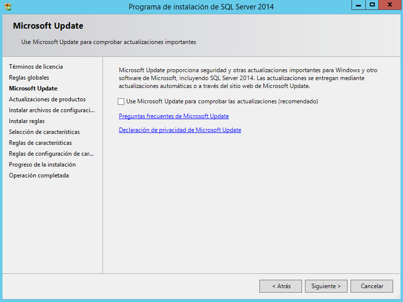

# U1_A4 Instalación de SQL Server 2014 Express en Windows Server 2012

- [Instalación de SQL Server Express 2014](#1)

- [Instalación Management Studio](#2)

- [Comprobación de acceso local desde Management Studio a la instancia de SQL Server](#3)

- [Instalación de Management Studio en un cliente Windows 7](#4)

- [Acceso remoto desde Management Studio de Windows 7 a la instancia de SQL Server del servidor Windows Server 2012, tanto por nombre de máquina como por IP. Investigar con los recursos del curso y realizar las configuraciones necesarias para estas conexiones](#5)

En la siguiente actividad tenemos que instalar el SQL Server Express 2014 y Management Studio en un Servidor Windows Server 2012.

## Instalación de SQL Server Express 2014

La instalación de SQL Server Express 2014 solo tenemos que ir a la siguiente página de Microsoft y descargar el programa de [SQL Server Express 2014](https://www.microsoft.com/es-es/download/details.aspx?id=42299).

## Instalación Management Studio

Solo debemos ejecutar la aplicación que descargamos de la página de Microsoft y seguir el asistente de modo por defecto, no es necesario cambiar nada de los valores.

Comprobamos que se realizó la instalación de SQL Server 2014

## Comprobación de acceso local desde Management Studio a la instancia de SQL Server

## Instalación de Management Studio en un cliente Windows 7 

## Acceso remoto desde Management Studio de Windows 7 a la instancia de SQL Server del servidor Windows Server 2012, tanto por nombre de máquina como por IP. Investigar con los recursos del curso y realizar las configuraciones necesarias para estas conexiones. 
