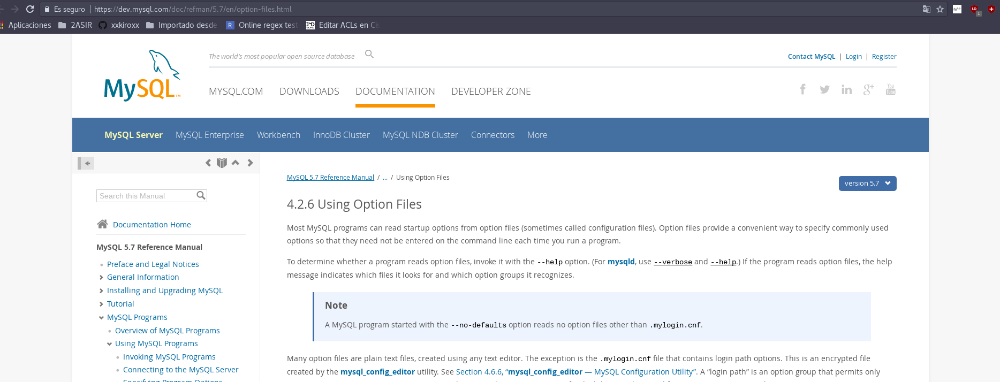
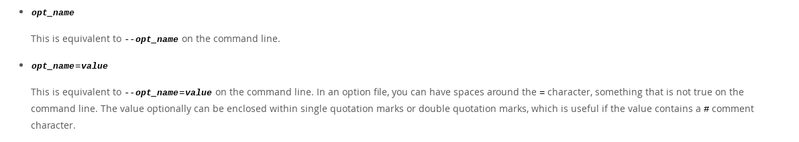
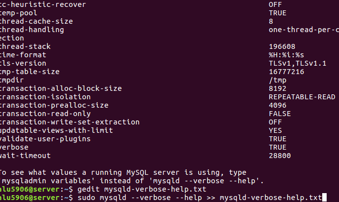

# Fichero de Opciones y variables de servidor en MySQL

## 1 Ficheros de opciones
El servidor dispone de un conjunto de variables que determinan su funcionamiento. Una de las tareas más importantes del administrador implica el conocimiento y ajuste óptimo de los valores de las mismas según los requerimientos de las aplicaciones.
Debemos diferenciar entre variables del servidor y las opciones que permiten modificar el valor de las variables.
Podemos ajustar los valores de las diferentes variables usando ficheros de opciones, incluyendo dichas opciones cuando arrancamos el servidor; o modificándolas con el comando SET (sólo en el caso de ser dinámicas).
La mejor forma de conocer las variables es buscarlas cuando se necesiten. En tal caso debemos consultar el manual donde disponemos de una referencia detallada, donde para cada variable se detallan normalmente su nombre largo y corto para usar en la línea de comandos, su nombre para ficheros de opciones (no siempe coincide), si son modificables con SET, el nombre de la variable, su alcance (global o de sesión) y si es dinámica (modificable en tiempo de ejecución), su dominio o valores permitidos, su tipo y su valor por defecto.

Ajustar variables con Ficheros de Opciones.
Cuando queremos que las opciones sean permanentes lo normal es hacer que los programas de MySQL (mysqld entre ellos) puedan leer opciones de inicio desde ficheros de opciones (también llamados ficheros de configuración). Estos proporcionan una forma conveniente de especificar opciones comúnmente usadas. Este fichero determina el funcionamiento de nuestro servidor.

## 1.2 Haz la lectura de la siguiente página "[Using Option Files](http://dev.mysql.com/doc/refman/5.7/en/option-files.html)"



Encuentra el fichero `my.ini o my.cnf` de tu instalación de MySQL (podría no estar en una ubicación no estándar).

```console

alu5906@server:~$ ls -l /etc/mysql/
total 48
drwxr-xr-x 2 root root  4096 oct 31 08:53 conf.d
-rw------- 1 root root   317 oct 31 08:55 debian.cnf
-rwxr-xr-x 1 root root   120 jul 19 20:28 debian-start
-rw-r--r-- 1 root root  1055 may 23  2015 fabric.cfg
lrwxrwxrwx 1 root root    24 oct 10 09:13 my.cnf -> /etc/alternatives/my.cnf
-rw-r--r-- 1 root root   839 ene 21  2017 my.cnf.fallback
-rw-r--r-- 1 root root   778 oct 10 14:02 my.cnf.wba.bak
-rw-r--r-- 1 root root   791 oct 10 14:02 mysql.cnf
drwxr-xr-x 2 root root  4096 oct 31 08:55 mysql.conf.d
-rw-r--r-- 1 root root 13132 feb 26  2015 mysql-fabric-doctrine-1.4.0.zip
alu5906@server:~$ cat /etc/mysql/mysql.cnf
#
# The MySQL database server configuration file.
#
# You can copy this to one of:
# - "/etc/mysql/my.cnf" to set global options,
# - "~/.my.cnf" to set user-specific options.
#
# One can use all long options that the program supports.
# Run program with --help to get a list of available options and with
# --print-defaults to see which it would actually understand and use.
#
# For explanations see
# http://dev.mysql.com/doc/mysql/en/server-system-variables.html

#
# * IMPORTANT: Additional settings that can override those from this file!
#   The files must end with '.cnf', otherwise they'll be ignored.
#

!includedir /etc/mysql/conf.d/
!includedir /etc/mysql/mysql.conf.d/

[mysqld]
bind-address = 0.0.0.0
skip-external-locking
lc-messages = es_ES
language = "spanish"

port = 3306
alu5906@server:~$


```

- ¿Cómo se escribe un comentario en este fichero?

Solo tenemos que escribir delante `# Escribe aquí` por lo tanto esa línea esta comentada.
Para comentar múltiple líneas `/* escribe aquí */`

Ejemplo

```console
alu5906@server:~$ cat /etc/mysql/mysql.cnf
#
# The MySQL database server configuration file.
#
# You can copy this to one of:
# - "/etc/mysql/my.cnf" to set global options,
# - "~/.my.cnf" to set user-specific options.
#
# One can use all long options that the program supports.
# Run program with --help to get a list of available options and with
# --print-defaults to see which it would actually understand and use.
#
# For explanations see
# http://dev.mysql.com/doc/mysql/en/server-system-variables.html

#
# * IMPORTANT: Additional settings that can override those from this file!
#   The files must end with '.cnf', otherwise they'll be ignored.
#

!includedir /etc/mysql/conf.d/
!includedir /etc/mysql/mysql.conf.d/

[mysqld]
bind-address = 0.0.0.0
skip-external-locking
lc-messages = es_ES
language = "spanish"

port = 3306

```

- ¿Y un grupo de opciones?


Solo tenemos que abrir unos corchetes `[Escribe_Nombre_Grupo]`.

``` bash
[mysqld]
bind-address = 0.0.0.0
skip-external-locking
lc-messages = es_ES
language = "spanish"

```
- ¿Todas las opciones tienen un valor?

Según algunas opciones necesitan un valor y otras no.



- Ejecuta "mysqld --verbose --help" desde una consola para ver una lista de las variables del servidor. Para ver mejor el texto mejor redirecciona la salida a fichero.

```console
alu5906@server:~$ sudo mysqld --verbose --help >> mysqld-verbose-help.txt

```
Ejemplo del fichero mysqld-verbose-help.texto



- Explica qué significan y que se consigue con cada una de las variables del siguiente fichero de configuración

```bash
[client] # Grupo Cliente
port=3306  # Puerto de escucha
password="telesforo"; # LA contraseña se enviará a todos los clientes MySQL estándar.

[mysqld] # Grupo del demonio de mysql
port=3306 # Puerto de escucha
key_buffer_size=16M # Es el tamaño del indice y depende de su tamaño ayuda para mejorar la lectura.
max_allowed_packet=8M # Tamaño máximo del paquete.

[mysqldump] # grupo de copia de seguridad
quick # Se realizará la copia de seguridad en modo rápido.
```

## 2 Variables del servidor
Haz la lecturas de los siguientes enlaces y responde documentando las preguntas:

- "Server System Variables" http://dev.mysql.com/doc/refman/5.7/en/server-system-variables.html

- "Using System Variables" http://dev.mysql.com/doc/refman/5.7/en/using-system-variables.html

Si queremos guardar el resultado de una consulta SQL en un fichero de texto, debemos construir la consulta del siguiente modo, ejemplo con un SELECT utilizando INTO OUTFILE :

```console
SELECT * INTO OUTFIELD '/var/lib/mysql-files/volcadosql.txt'
FROM tabla
WHERE ... ;

```
Podéis observar que el modo es usar INTO OUTFILE y posteriormente indicarle la ruta y nombre del fichero a crear, sobre el que tras ejecutar la consulta quedarán volcados los datos.

MySQL soporta varios motores de almacenamiento (storage engine)que tratan con distintos tipos de tabla. Los motores de almacenamiento de MySQL incluyen algunos que tratan con tablas transaccionales y otros que no lo hacen. Normalmente se utiliza MyISAM para lecturas rápidas e InnoDB para transacciones e integridad referencial. Si deseamos cambiar el motor por defecto para la creación de nuevas tablas en MySQL, debemos añadir la siguiente línea al ficher `my.cnf (Linux) o my.ini (Windows)`, en este caso sería para poner como motor por defecto MyISAM:

`default-storage-engine=MyIsam`

Si quisieramos poner por defecto InnoDB:

`default-storage-engine=InnoDB`

1. Define qué son las variables del servidor.

MySQL tiene muchas variables del sistema que indican cómo están configurado. La gran mayoría se puede modificar dinámicamente mientras el servidor esta corriendo.

- Existen dos tipos.

    - **Globales:** afectan la operación del servidor completo.
    - **Sesión:** Afectan la operación de las conexiones de clientes individuales.


2. Usa el comando "SHOW VARIABLES" para conocer el valor de todas las variables y enviar el resultado a un fichero.

```console

alu5906@server:~$ mysql -u root -p -e "show variables;" > /home/alu5906/variables.txt
Enter password:
alu5906@server:~$ ls -l variables.txt
-rw-rw-r-- 1 alu5906 alu5906 14769 oct 31 19:10 variables.txt
alu5906@server:~$ cat variables.txt | grep wait_timeout
innodb_lock_wait_timeout	50
lock_wait_timeout	31536000
wait_timeout	28800
alu5906@server:~$

```
No muestro todo el fichero de variables.txt porque es muy grande, por lo tanto realice un filtro con el `grep` para buscar una variable en concreto en este caso fue wait_timeout.

3. Repite lo anterior para mostrar solo las variables relacionadas con el motor "InnoDB".

En la siguiente demostración primero mostramos los motores y luego pasamos aun fichero de texto. Comprobamos que ese fichero tiene todos los datos de los motores engines.

```console
alu5906@server:~$ mysql -u root -p -e "show engines;"
Enter password:
+--------------------+---------+----------------------------------------------------------------+--------------+------+------------+
| Engine             | Support | Comment                                                        | Transactions | XA   | Savepoints |
+--------------------+---------+----------------------------------------------------------------+--------------+------+------------+
| MEMORY             | YES     | Hash based, stored in memory, useful for temporary tables      | NO           | NO   | NO         |
| MRG_MYISAM         | YES     | Collection of identical MyISAM tables                          | NO           | NO   | NO         |
| CSV                | YES     | CSV storage engine                                             | NO           | NO   | NO         |
| BLACKHOLE          | YES     | /dev/null storage engine (anything you write to it disappears) | NO           | NO   | NO         |
| PERFORMANCE_SCHEMA | YES     | Performance Schema                                             | NO           | NO   | NO         |
| MyISAM             | YES     | MyISAM storage engine                                          | NO           | NO   | NO         |
| ARCHIVE            | YES     | Archive storage engine                                         | NO           | NO   | NO         |
| InnoDB             | DEFAULT | Supports transactions, row-level locking, and foreign keys     | YES          | YES  | YES        |
| FEDERATED          | NO      | Federated MySQL storage engine                                 | NULL         | NULL | NULL       |
+--------------------+---------+----------------------------------------------------------------+--------------+------+------------+
alu5906@server:~$ mysql -u root -p -e "show engines;" > engines.txt
Enter password:
alu5906@server:~$ ls -l engines.txt
-rw-rw-r-- 1 alu5906 alu5906 594 oct 31 19:17 engines.txt
alu5906@server:~$ cat engines.txt | grep MyISAM
MRG_MYISAM	YES	Collection of identical MyISAM tables	NO	NO	NO
MyISAM	YES	MyISAM storage engine	NO	NO	NO
alu5906@server:~$
```


4. Para gestionar variables tenemos, como hemos visto, el comando SHOW "comando":

- cómo mostrar todos los motores de almacenamiento

    `show engines;`

```consoles
mysql> show engines;
+--------------------+---------+----------------------------------------------------------------+--------------+------+------------+
| Engine             | Support | Comment                                                        | Transactions | XA   | Savepoints |
+--------------------+---------+----------------------------------------------------------------+--------------+------+------------+
| MEMORY             | YES     | Hash based, stored in memory, useful for temporary tables      | NO           | NO   | NO         |
| MRG_MYISAM         | YES     | Collection of identical MyISAM tables                          | NO           | NO   | NO         |
| CSV                | YES     | CSV storage engine                                             | NO           | NO   | NO         |
| BLACKHOLE          | YES     | /dev/null storage engine (anything you write to it disappears) | NO           | NO   | NO         |
| PERFORMANCE_SCHEMA | YES     | Performance Schema                                             | NO           | NO   | NO         |
| MyISAM             | YES     | MyISAM storage engine                                          | NO           | NO   | NO         |
| ARCHIVE            | YES     | Archive storage engine                                         | NO           | NO   | NO         |
| InnoDB             | DEFAULT | Supports transactions, row-level locking, and foreign keys     | YES          | YES  | YES        |
| FEDERATED          | NO      | Federated MySQL storage engine                                 | NULL         | NULL | NULL       |
+--------------------+---------+----------------------------------------------------------------+--------------+------+------------+
9 rows in set (0,00 sec)
```

- cómo mostrar el estado actual del servidor

    `show status;`

- cómo averiguar todos los clientes que están conectados al servidor

    `show processlist;`

```console

    mysql> show processlist;
+----+------+-----------+------+---------+------+----------+------------------+
| Id | User | Host      | db   | Command | Time | State    | Info             |
+----+------+-----------+------+---------+------+----------+------------------+
| 12 | root | localhost | NULL | Query   |    0 | starting | show processlist |
+----+------+-----------+------+---------+------+----------+------------------+
1 row in set (0,00 sec)

```

- cómo conocer todas las tablas que están abiertas

    `show open tables;`

### 2.1 Variables de estado

Haz la lecturas de los siguientes enlaces y responde documentando las preguntas:

- "Server Status Variables" http://dev.mysql.com/doc/refman/5.7/en/server-status-variables.html

- "SHOW STATUS Syntax" http://dev.mysql.com/doc/refman/5.7/en/show-status.html

- "SHOW Syntax" http://dev.mysql.com/doc/refman/5.7/en/show.html


1. Define qué son las variables de estado.

Son para saber como está funcionando nuestra base de datos, si tiene algún fallo. Simplemente monitoriza regularmente el estado de MYSQL.

2. Usa el comando "SHOW STATUS" para conocer el valor de todas las variables..

Utilizamos el comando `show status;` para comprobar los valores de las variables.

Para visualizar mejor el status de todos los valores de la variables es recomendable enviar todo aun fichero.

```console
alu5906@server:~$ mysql -u root -p -e "show status;" > status.txt
Enter password:
alu5906@server:~$ ls -l status.txt
-rw-rw-r-- 1 alu5906 alu5906 8287 oct 31 19:47 status.txt
alu5906@server:~$ cat status.txt | grep Tc_log_page_size
Tc_log_page_size	0
alu5906@server:~$
```

3. Haz que uno o más de tus compañeros se conecte a tu servidor (puede que por cuestión de permisos no os podáis conectar).

La conexión la realizó con una máquina virtual cliente que tengo creada y me conecto con el usuario ya creado llamado roberto. Me conecta correctamente d la siguiente forma.

```console

alu5906@cliente:~$ mysql -u roberto -h 172.18.22.2 -p
Enter password:
Welcome to the MySQL monitor.  Commands end with ; or \g.
Your MySQL connection id is 16
Server version: 5.7.20-0ubuntu0.16.04.1 (Ubuntu)

Copyright (c) 2000, 2017, Oracle and/or its affiliates. All rights reserved.

Oracle is a registered trademark of Oracle Corporation and/or its
affiliates. Other names may be trademarks of their respective
owners.

Type 'help;' or '\h' for help. Type '\c' to clear the current input statement.

mysql>

```

4. Comprueba quién está conectado usando el comando correspondiente (Pista: es un comando visto `SHOW processlist;`).

```console
mysql> show processlist;
+----+---------+-------------------+------+---------+------+----------+------------------+
| Id | User    | Host              | db   | Command | Time | State    | Info             |
+----+---------+-------------------+------+---------+------+----------+------------------+
| 12 | root    | localhost         | NULL | Query   |    0 | starting | show processlist |
| 13 | roberto | 172.18.22.3:44442 | NULL | Sleep   |  308 |          | NULL             |
+----+---------+-------------------+------+---------+------+----------+------------------+
2 rows in set (0,00 sec)

```

5. Intenta desconectarlo con el comando `kill`"

```console
mysql> show processlist;
+----+---------+-------------------+------+---------+------+----------+------------------+
| Id | User    | Host              | db   | Command | Time | State    | Info             |
+----+---------+-------------------+------+---------+------+----------+------------------+
| 12 | root    | localhost         | NULL | Query   |    0 | starting | show processlist |
| 16 | roberto | 172.18.22.3:48702 | NULL | Sleep   |   46 |          | NULL             |
+----+---------+-------------------+------+---------+------+----------+------------------+
2 rows in set (0,00 sec)

mysql> kill 16;
Query OK, 0 rows affected (0,00 sec)

mysql> show processlist;
+----+------+-----------+------+---------+------+----------+------------------+
| Id | User | Host      | db   | Command | Time | State    | Info             |
+----+------+-----------+------+---------+------+----------+------------------+
| 12 | root | localhost | NULL | Query   |    0 | starting | show processlist |
+----+------+-----------+------+---------+------+----------+------------------+
1 row in set (0,00 sec)

mysql>

```

6. ¿Cuántas consultas se están ejecutado hasta el momento en tu servidor MYSQL? ¿Y si se trata de consultas lentas?


7. Un estado informa  el sobre el máximo de conexiones concurrentes que se ha dado en la sesión de trabajo. ¿Cuál es?

### 2.2 Variables dinámicas
Son aquellas que son modificables en tiempo de ejecución.

Haz la lectura de los siguientes enlaces y contesta razonadamente a las preguntas:

- "Dynamic System Variables" http://dev.mysql.com/doc/refman/5.7/en/dynamic-system-variables.html

- "SET Syntax" http://dev.mysql.com/doc/refman/5.7/en/set-statement.html


1. Detalla los posibles atributos que tendría una variable de servidor como "port".

|Command-Line Format | | |
|---- |---- |---- |
|System Variable|	Name|	port|
|               |Variable Scope| |
|               |Dynamic Variable| |
|               |Dynamic Variable| |
|  Permitted Values	             |Type	| |
|               |Default| |
|               |Min Value| |
|               |Max Value| |


2.-¿Cómo podemos saber si una variable es dinámica o no?

## 3.-¿Qué hace la variable "uptime"?

- Indica su valor en tu servidor


- ¿Es posible modificar su valor con comando SET?


## 4.- Localiza la variable que establece el límite de conexiones concurrentes. ¿Cuál es?

Modifícala y establece un máximo de 100 conexiones concurrentes
