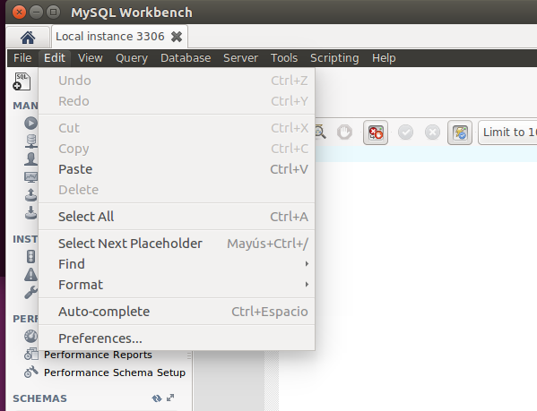
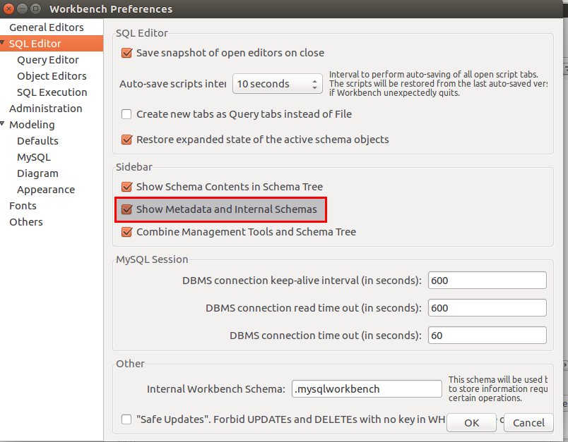
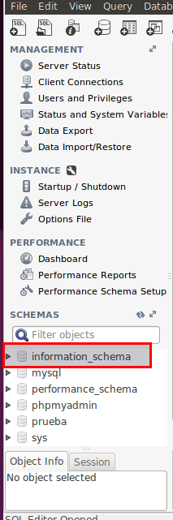

# Diccionario de Datos

- [Interrogando la bases de datos Information_schema](#1)
- [](#2)
- [](#3)
- [](#4)

## Estructura del Diccionario de datos
El diccionario de datos es un componente esencial en cualquier SGBD ya que contiene información (metadatos) sobre los objetos de las bases de datos alojadas en nuestro servidor. Metadatos son datos acerca de los datos, tales como el nombre de las bases de datos o tablas, el tipo de datos de una columna o los permisos de accesso. Otros términos sinónimos son "Diccionario de datos" o "Catálogo del sistema".

En la mayoría de SGBD esta información se almacena en una base de datos. Para el caso de MySQL, dicha base de datos se crea por defecto en la instalación, denominada **information_schema**.

Haz la lectura de las siguientes páginas y responde a las preguntas razonadamente:

- "INFORMATION_SCHEMA"
 http://dev.mysql.com/doc/refman/5.7/en/information-schema.html

- "The INFORMATION_SCHEMA TABLES"  http://dev.mysql.com/doc/refman/5.7/en/tables-table.html


### 1. Interrogando la bases de datos **Information_schema**, extrae información (atributos table_name, table_type) sobre las tablas que conforman la base de datos "sakila".<a name="1"></a>

Para mostrar la base de datos de information-schema tenemos que ejecutar el Workbench y habilitar para que se pueda visualizar dicha base de datos.



- Seleccionamos preferences.



- Marcamos show metadata and internal schemas.




En ubuntu no tenemos instalado `sakila` por lo tanto me descargo dicha base de datos.
El siguiente progreso es como meter la base de datos de `sakila`. En esté [enlace](http://relopezbriega.com.ar/2012/mysql/mysql-instalando-sakila-database/) explica como instalar las base de datos `sakila`

```console
alu5906@server:~/basedatos/sakila-db$ mysql -u root -p
Enter password:
Welcome to the MySQL monitor.  Commands end with ; or \g.
Your MySQL connection id is 18
Server version: 5.7.20-0ubuntu0.16.04.1-log (Ubuntu)

Copyright (c) 2000, 2017, Oracle and/or its affiliates. All rights reserved.

Oracle is a registered trademark of Oracle Corporation and/or its
affiliates. Other names may be trademarks of their respective
owners.

Type 'help;' or '\h' for help. Type '\c' to clear the current input statement.

mysql> source /home/alu5906/basedatos/sakila-db/sakila-schema.sql;
Query OK, 0 rows affected (0,00 sec)

Query OK, 0 rows affected (0,00 sec)

Query OK, 0 rows affected (0,00 sec)

Query OK, 0 rows affected, 1 warning (0,00 sec)

Query OK, 1 row affected (0,00 sec)

Database changed
Query OK, 0 rows affected (0,10 sec)

Query OK, 0 rows affected (0,01 sec)

Query OK, 0 rows affected (0,01 sec)

Query OK, 0 rows affected (0,00 sec)

Query OK, 0 rows affected (0,01 sec)

Query OK, 0 rows affected (0,01 sec)

Query OK, 0 rows affected (0,01 sec)

Query OK, 0 rows affected (0,00 sec)

Query OK, 0 rows affected (0,01 sec)

Query OK, 0 rows affected (0,03 sec)

Query OK, 0 rows affected (0,00 sec)

Query OK, 0 rows affected (0,00 sec)

Query OK, 0 rows affected (0,01 sec)

Query OK, 0 rows affected (0,01 sec)

Query OK, 0 rows affected (0,00 sec)

Query OK, 0 rows affected (0,01 sec)

Query OK, 0 rows affected (0,00 sec)

Query OK, 0 rows affected (0,02 sec)

Query OK, 0 rows affected (0,00 sec)

Query OK, 0 rows affected (0,00 sec)

Query OK, 0 rows affected (0,00 sec)

Query OK, 0 rows affected (0,00 sec)

Query OK, 0 rows affected (0,01 sec)

Query OK, 0 rows affected (0,00 sec)

Query OK, 0 rows affected (0,00 sec)

Query OK, 0 rows affected (0,00 sec)

Query OK, 0 rows affected (0,00 sec)

Query OK, 0 rows affected (0,00 sec)

Query OK, 0 rows affected (0,00 sec)

Query OK, 0 rows affected (0,00 sec)

Query OK, 0 rows affected (0,00 sec)

Query OK, 0 rows affected (0,00 sec)

Query OK, 0 rows affected (0,00 sec)

Query OK, 0 rows affected (0,00 sec)

Query OK, 0 rows affected (0,00 sec)

mysql> source /home/alu5906/basedatos/sakila-db/sakila-data.sql;
Query OK, 0 rows affected (0,00 sec)

Query OK, 0 rows affected (0,00 sec)

Query OK, 0 rows affected (0,00 sec)

Database changed
Query OK, 0 rows affected (0,00 sec)

Query OK, 200 rows affected (0,00 sec)
Registros: 200  Duplicados: 0  Peligros: 0

Query OK, 0 rows affected (0,02 sec)

Query OK, 0 rows affected (0,00 sec)

Query OK, 603 rows affected (0,05 sec)
Registros: 603  Duplicados: 0  Peligros: 0

Query OK, 0 rows affected (0,03 sec)

Query OK, 0 rows affected (0,00 sec)

Query OK, 16 rows affected (0,00 sec)
Registros: 16  Duplicados: 0  Peligros: 0

Query OK, 0 rows affected (0,00 sec)

Query OK, 0 rows affected (0,00 sec)

Query OK, 600 rows affected (0,01 sec)
Registros: 600  Duplicados: 0  Peligros: 0

Query OK, 0 rows affected (0,00 sec)

Query OK, 0 rows affected (0,00 sec)

Query OK, 109 rows affected (0,00 sec)
Registros: 109  Duplicados: 0  Peligros: 0

Query OK, 0 rows affected (0,00 sec)

Query OK, 0 rows affected (0,00 sec)

Query OK, 599 rows affected (0,01 sec)
Registros: 599  Duplicados: 0  Peligros: 0

Query OK, 0 rows affected (0,00 sec)

Query OK, 0 rows affected (0,00 sec)

Query OK, 0 rows affected (0,00 sec)

Query OK, 1000 rows affected (0,06 sec)
Registros: 1000  Duplicados: 0  Peligros: 0

Query OK, 0 rows affected (0,01 sec)

Query OK, 0 rows affected (0,00 sec)

Query OK, 5462 rows affected (0,04 sec)
Registros: 5462  Duplicados: 0  Peligros: 0

Query OK, 0 rows affected (0,02 sec)

Query OK, 0 rows affected (0,00 sec)

Query OK, 1000 rows affected (0,02 sec)
Registros: 1000  Duplicados: 0  Peligros: 0

Query OK, 0 rows affected (0,00 sec)

Query OK, 0 rows affected (0,00 sec)

Query OK, 4581 rows affected (0,05 sec)
Registros: 4581  Duplicados: 0  Peligros: 0

Query OK, 0 rows affected (0,00 sec)

Query OK, 0 rows affected (0,00 sec)

Query OK, 6 rows affected (0,00 sec)
Registros: 6  Duplicados: 0  Peligros: 0

Query OK, 0 rows affected (0,00 sec)

Query OK, 0 rows affected (0,00 sec)

Query OK, 14885 rows affected (0,22 sec)
Registros: 14885  Duplicados: 0  Peligros: 0

Query OK, 1164 rows affected (0,01 sec)
Registros: 1164  Duplicados: 0  Peligros: 0

Query OK, 0 rows affected (0,04 sec)

Query OK, 0 rows affected (0,00 sec)

Query OK, 0 rows affected (0,00 sec)

Query OK, 12377 rows affected (0,24 sec)
Registros: 12377  Duplicados: 0  Peligros: 0

Query OK, 3667 rows affected (0,06 sec)
Registros: 3667  Duplicados: 0  Peligros: 0

Query OK, 0 rows affected (0,03 sec)

Query OK, 0 rows affected (0,00 sec)

Query OK, 0 rows affected (0,00 sec)

Query OK, 0 rows affected (0,00 sec)

Query OK, 0 rows affected, 1 warning (0,00 sec)

Query OK, 2 rows affected (0,01 sec)
Registros: 2  Duplicados: 0  Peligros: 0

Query OK, 0 rows affected, 1 warning (0,00 sec)

Query OK, 0 rows affected (0,00 sec)

Query OK, 0 rows affected (0,00 sec)

Query OK, 0 rows affected (0,00 sec)

Query OK, 2 rows affected (0,00 sec)
Registros: 2  Duplicados: 0  Peligros: 0

Query OK, 0 rows affected (0,00 sec)

Query OK, 0 rows affected (0,00 sec)

Query OK, 0 rows affected (0,00 sec)

Query OK, 0 rows affected (0,00 sec)

mysql>

```

- Realizamos la consulta para extraer la información de la base de datos sakila con la information_schema.

```console
mysql> use information_schema;
Reading table information for completion of table and column names
You can turn off this feature to get a quicker startup with -A

Database changed
mysql> select table_name, table_type from TABLES where TABLE_SCHEMA='sakila';
+----------------------------+------------+
| table_name                 | table_type |
+----------------------------+------------+
| actor                      | BASE TABLE |
| actor_info                 | VIEW       |
| address                    | BASE TABLE |
| category                   | BASE TABLE |
| city                       | BASE TABLE |
| country                    | BASE TABLE |
| customer                   | BASE TABLE |
| customer_list              | VIEW       |
| film                       | BASE TABLE |
| film_actor                 | BASE TABLE |
| film_category              | BASE TABLE |
| film_list                  | VIEW       |
| film_text                  | BASE TABLE |
| inventory                  | BASE TABLE |
| language                   | BASE TABLE |
| nicer_but_slower_film_list | VIEW       |
| payment                    | BASE TABLE |
| rental                     | BASE TABLE |
| sales_by_film_category     | VIEW       |
| sales_by_store             | VIEW       |
| staff                      | BASE TABLE |
| staff_list                 | VIEW       |
| store                      | BASE TABLE |
+----------------------------+------------+
23 rows in set (0,00 sec)

mysql>

```

### 2. ¿Cuál es el comando SHOW equivalente al anterior?<a name="2"></a>

Tenemos que utilizar la base de datos sakila y realizamos la búsqueda con el comando `show` de todas las tablas y ver el tipo de la tabla.

```console
mysql> use sakila;
Reading table information for completion of table and column names
You can turn off this feature to get a quicker startup with -A

Database changed
mysql> show full tables;
+----------------------------+------------+
| Tables_in_sakila           | Table_type |
+----------------------------+------------+
| actor                      | BASE TABLE |
| actor_info                 | VIEW       |
| address                    | BASE TABLE |
| category                   | BASE TABLE |
| city                       | BASE TABLE |
| country                    | BASE TABLE |
| customer                   | BASE TABLE |
| customer_list              | VIEW       |
| film                       | BASE TABLE |
| film_actor                 | BASE TABLE |
| film_category              | BASE TABLE |
| film_list                  | VIEW       |
| film_text                  | BASE TABLE |
| inventory                  | BASE TABLE |
| language                   | BASE TABLE |
| nicer_but_slower_film_list | VIEW       |
| payment                    | BASE TABLE |
| rental                     | BASE TABLE |
| sales_by_film_category     | VIEW       |
| sales_by_store             | VIEW       |
| staff                      | BASE TABLE |
| staff_list                 | VIEW       |
| store                      | BASE TABLE |
+----------------------------+------------+
23 rows in set (0,00 sec)

mysql>
```
### 3. Repite lo mismo extrayendo la información sobre el esquema de una tabla en particular de la base de datos "sakila" (atributos column_name, data_type, is_nullable, column_default). Usar tabla columns<a name="3"></a>

Para sacar o extraer la información de la tabla en particular en esté caso `actor` de la base de datos `sakila`.

```console
mysql> use information_schema;
Reading table information for completion of table and column names
You can turn off this feature to get a quicker startup with -A

Database changed
mysql> select COLUMN_NAME, DATA_TYPE, IS_NULLABLE,COLUMN_DEFAULT from COLUMNS where TABLE_NAME='actor';
+-------------+-----------+-------------+-------------------+
| COLUMN_NAME | DATA_TYPE | IS_NULLABLE | COLUMN_DEFAULT    |
+-------------+-----------+-------------+-------------------+
| actor_id    | smallint  | NO          | NULL              |
| first_name  | varchar   | NO          | NULL              |
| last_name   | varchar   | NO          | NULL              |
| last_update | timestamp | NO          | CURRENT_TIMESTAMP |
+-------------+-----------+-------------+-------------------+
4 rows in set (0,01 sec)

mysql>

```
- Pero si tenemos otra base de datos con una tabla llamada `actor` por lo tanto debemos especificar la base de datos.

```console

mysql> select COLUMN_NAME, DATA_TYPE, IS_NULLABLE,COLUMN_DEFAULT from COLUMNS where TABLE_NAME='actor' and table_schema='sakila';
+-------------+-----------+-------------+-------------------+
| COLUMN_NAME | DATA_TYPE | IS_NULLABLE | COLUMN_DEFAULT    |
+-------------+-----------+-------------+-------------------+
| actor_id    | smallint  | NO          | NULL              |
| first_name  | varchar   | NO          | NULL              |
| last_name   | varchar   | NO          | NULL              |
| last_update | timestamp | NO          | CURRENT_TIMESTAMP |
+-------------+-----------+-------------+-------------------+
4 rows in set (0,00 sec)

mysql>

```

### 4. ¿Cuál es el comando SHOW equivalente al anterior?<a name="4"></a>

Vamos a realizar dos ejemplos tanto con el `show` y con el `describe`, ya que los dos realizan la misma acción.

- Ejemplo con `describe`

```console

mysql> use sakila;
Reading table information for completion of table and column names
You can turn off this feature to get a quicker startup with -A

Database changed
mysql> describe actor;
+-------------+----------------------+------+-----+-------------------+-----------------------------+
| Field       | Type                 | Null | Key | Default           | Extra                       |
+-------------+----------------------+------+-----+-------------------+-----------------------------+
| actor_id    | smallint(5) unsigned | NO   | PRI | NULL              | auto_increment              |
| first_name  | varchar(45)          | NO   |     | NULL              |                             |
| last_name   | varchar(45)          | NO   | MUL | NULL              |                             |
| last_update | timestamp            | NO   |     | CURRENT_TIMESTAMP | on update CURRENT_TIMESTAMP |
+-------------+----------------------+------+-----+-------------------+-----------------------------+
4 rows in set (0,00 sec)


```

- Ejemplo `show`

```console
mysql> show columns from actor;
+-------------+----------------------+------+-----+-------------------+-----------------------------+
| Field       | Type                 | Null | Key | Default           | Extra                       |
+-------------+----------------------+------+-----+-------------------+-----------------------------+
| actor_id    | smallint(5) unsigned | NO   | PRI | NULL              | auto_increment              |
| first_name  | varchar(45)          | NO   |     | NULL              |                             |
| last_name   | varchar(45)          | NO   | MUL | NULL              |                             |
| last_update | timestamp            | NO   |     | CURRENT_TIMESTAMP | on update CURRENT_TIMESTAMP |
+-------------+----------------------+------+-----+-------------------+-----------------------------+
4 rows in set (0,00 sec)

mysql>

```


### 5. Atendiendo a la base de datos "Information_schema", ¿cuáles son las tablas principales según tu criterio? Puedes ayudarte para ver todas las tablas utilizando Workbench. Para ello ir a preferencias y activar ver los metadatos.

Realizamos una consulta sobre la base de datos information_schema.

```console
mysql> use information_schema ;
Reading table information for completion of table and column names
You can turn off this feature to get a quicker startup with -A

Database changed
mysql> show full tables;
+---------------------------------------+-------------+
| Tables_in_information_schema          | Table_type  |
+---------------------------------------+-------------+
| CHARACTER_SETS                        | SYSTEM VIEW |
| COLLATIONS                            | SYSTEM VIEW |
| COLLATION_CHARACTER_SET_APPLICABILITY | SYSTEM VIEW |
| COLUMNS                               | SYSTEM VIEW |
| COLUMN_PRIVILEGES                     | SYSTEM VIEW |
| ENGINES                               | SYSTEM VIEW |
| EVENTS                                | SYSTEM VIEW |
| FILES                                 | SYSTEM VIEW |
| GLOBAL_STATUS                         | SYSTEM VIEW |
| GLOBAL_VARIABLES                      | SYSTEM VIEW |
| KEY_COLUMN_USAGE                      | SYSTEM VIEW |
| OPTIMIZER_TRACE                       | SYSTEM VIEW |
| PARAMETERS                            | SYSTEM VIEW |
| PARTITIONS                            | SYSTEM VIEW |
| PLUGINS                               | SYSTEM VIEW |
| PROCESSLIST                           | SYSTEM VIEW |
| PROFILING                             | SYSTEM VIEW |
| REFERENTIAL_CONSTRAINTS               | SYSTEM VIEW |
| ROUTINES                              | SYSTEM VIEW |
| SCHEMATA                              | SYSTEM VIEW |
| SCHEMA_PRIVILEGES                     | SYSTEM VIEW |
| SESSION_STATUS                        | SYSTEM VIEW |
| SESSION_VARIABLES                     | SYSTEM VIEW |
| STATISTICS                            | SYSTEM VIEW |
| TABLES                                | SYSTEM VIEW |
| TABLESPACES                           | SYSTEM VIEW |
| TABLE_CONSTRAINTS                     | SYSTEM VIEW |
| TABLE_PRIVILEGES                      | SYSTEM VIEW |
| TRIGGERS                              | SYSTEM VIEW |
| USER_PRIVILEGES                       | SYSTEM VIEW |
| VIEWS                                 | SYSTEM VIEW |
| INNODB_LOCKS                          | SYSTEM VIEW |
| INNODB_TRX                            | SYSTEM VIEW |
| INNODB_SYS_DATAFILES                  | SYSTEM VIEW |
| INNODB_FT_CONFIG                      | SYSTEM VIEW |
| INNODB_SYS_VIRTUAL                    | SYSTEM VIEW |
| INNODB_CMP                            | SYSTEM VIEW |
| INNODB_FT_BEING_DELETED               | SYSTEM VIEW |
| INNODB_CMP_RESET                      | SYSTEM VIEW |
| INNODB_CMP_PER_INDEX                  | SYSTEM VIEW |
| INNODB_CMPMEM_RESET                   | SYSTEM VIEW |
| INNODB_FT_DELETED                     | SYSTEM VIEW |
| INNODB_BUFFER_PAGE_LRU                | SYSTEM VIEW |
| INNODB_LOCK_WAITS                     | SYSTEM VIEW |
| INNODB_TEMP_TABLE_INFO                | SYSTEM VIEW |
| INNODB_SYS_INDEXES                    | SYSTEM VIEW |
| INNODB_SYS_TABLES                     | SYSTEM VIEW |
| INNODB_SYS_FIELDS                     | SYSTEM VIEW |
| INNODB_CMP_PER_INDEX_RESET            | SYSTEM VIEW |
| INNODB_BUFFER_PAGE                    | SYSTEM VIEW |
| INNODB_FT_DEFAULT_STOPWORD            | SYSTEM VIEW |
| INNODB_FT_INDEX_TABLE                 | SYSTEM VIEW |
| INNODB_FT_INDEX_CACHE                 | SYSTEM VIEW |
| INNODB_SYS_TABLESPACES                | SYSTEM VIEW |
| INNODB_METRICS                        | SYSTEM VIEW |
| INNODB_SYS_FOREIGN_COLS               | SYSTEM VIEW |
| INNODB_CMPMEM                         | SYSTEM VIEW |
| INNODB_BUFFER_POOL_STATS              | SYSTEM VIEW |
| INNODB_SYS_COLUMNS                    | SYSTEM VIEW |
| INNODB_SYS_FOREIGN                    | SYSTEM VIEW |
| INNODB_SYS_TABLESTATS                 | SYSTEM VIEW |
+---------------------------------------+-------------+
61 rows in set (0,00 sec)

mysql>
```
