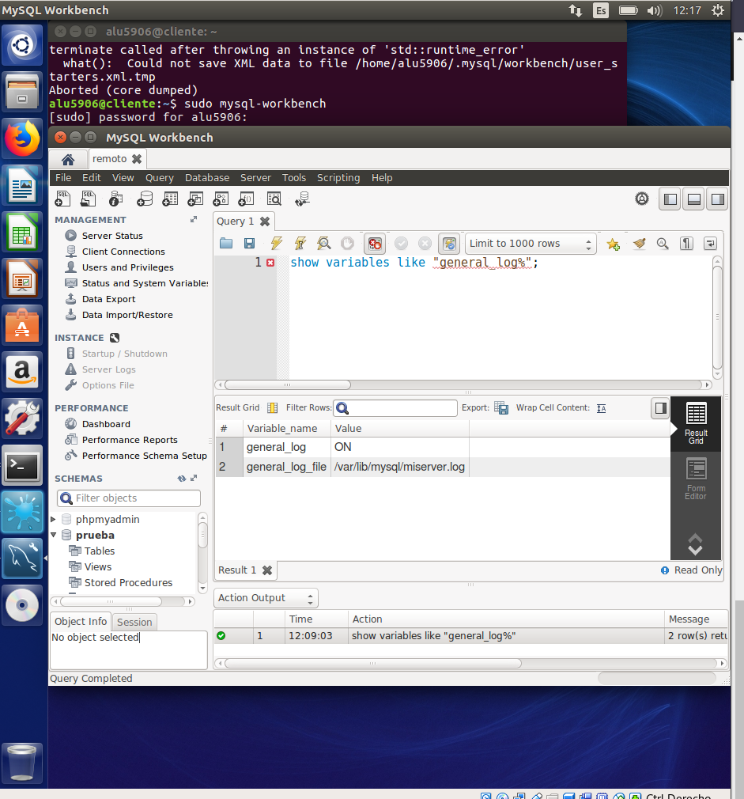

# 4.- Ficheros Log

## Ficheros LOG: Error LOG
El fichero "Error Log" registra problemas encontrados iniciando, ejecutando o parando mysqld.
Lee el pdf de la UD1.- Instalación y Configuración de un SGBD, la parte 5 de  Los Ficheros LOG
Haz la lectura de la siguiente página y contesta a las preguntas razonadamente:

- MySQL Server Logs: http://dev.mysql.com/doc/refman/5.7/en/server-logs.html

- The Error Log: http://dev.mysql.com/doc/refman/5.7/en/error-log.html


### 1. Explica qué es y para qué sirve el "ERROR LOG"

El registro de errores contiene un registro de los tiempos de inicio y apagado de mysqld . También contiene mensajes de diagnóstico como errores, advertencias y notas que se producen durante el inicio y el apagado del servidor, y mientras el servidor se está ejecutando. Por ejemplo, si mysqld nota que una tabla necesita ser revisada o reparada automáticamente, escribe un mensaje en el registro de errores.

El fichero de `error.log` está en la siguiente ruta. `/var/log/mysql/error.log`

```console
alu5906@server:/etc/mysql$ ls -l /var/log/mysql/
total 124
-rw-r----- 1 mysql adm   59890 nov 22 08:56 error.log
-rw-r----- 1 mysql adm    5878 nov 22 08:16 error.log.1.gz
-rw-r----- 1 mysql adm    2761 nov 21 08:44 error.log.2.gz
-rw-r----- 1 mysql adm    2457 nov 15 08:18 error.log.3.gz
-rw-r----- 1 mysql adm    4354 nov  8 08:41 error.log.4.gz
-rw-r----- 1 mysql adm    5287 nov  7 08:12 error.log.5.gz
-rw-r----- 1 mysql adm   10093 oct 31 08:53 error.log.6.gz
-rw-r----- 1 mysql adm    1669 nov 22 08:55 mysql-slow.log
-rw-r----- 1 mysql adm     172 nov 22 08:16 mysql-slow.log.1.gz
-rw-r----- 1 mysql adm    2017 nov 21 08:45 mysql-slow.log.2.gz
-rw-r----- 1 mysql mysql   494 nov 15 08:17 mysql-slow.log.3.gz
alu5906@server:/etc/mysql$
```
- Comprobamos el fichero error.log

```console
alu5906@server:/etc/mysql$ tail -f /var/log/mysql/error.log
2017-11-22T08:55:33.965891Z 0 [Note] InnoDB: Buffer pool(s) load completed at 171122  8:55:33
2017-11-22T08:55:33.965954Z 0 [Note] /usr/sbin/mysqld: ready for connections.
Version: '5.7.20-0ubuntu0.16.04.1-log'  socket: '/var/run/mysqld/mysqld.sock'  port: 3306  (Ubuntu)
2017-11-22T08:55:33.965961Z 0 [Note] Executing 'SELECT * FROM INFORMATION_SCHEMA.TABLES;' to get a list of tables using the deprecated partition engine. You may use the startup option '--disable-partition-engine-check' to skip this check.
2017-11-22T08:55:33.965963Z 0 [Note] Beginning of list of non-natively partitioned tables
2017-11-22T08:55:33.972834Z 0 [Note] End of list of non-natively partitioned tables
2017-11-22T08:55:34.738502Z 3 [Note] Acceso negado para usuario: 'root'@'localhost' (Usando clave: NO)
2017-11-22T08:56:16.986121Z 4 [Note] Acceso negado para usuario: 'root'@'localhost' (Usando clave: SI)
2017-11-22T08:56:41.305825Z 5 [Note] Acceso negado para usuario: 'root'@'localhost' (Usando clave: SI)
2017-11-22T08:56:53.397630Z 6 [Note] Acceso negado para usuario: 'root'@'localhost' (Usando clave: NO)
```

### 2. Indica al servidor en "my.cnf" que registre los errores en un fichero llamado "server_error". Reinicia el servidor y comprueba los mensajes visualizando dicho fichero.

Para modificar el fichero por defecto de `/var/log/mysql/error.log`

Tenemos que entrar en el fichero de configuración `/etc/mysql/my.cnf`

```console
alu5906@server:~$ cat /etc/mysql/my.cnf
#
# The MySQL database server configuration file.
#
# You can copy this to one of:
# - "/etc/mysql/my.cnf" to set global options,
# - "~/.my.cnf" to set user-specific options.
#
# One can use all long options that the program supports.
# Run program with --help to get a list of available options and with
# --print-defaults to see which it would actually understand and use.
#
# For explanations see
# http://dev.mysql.com/doc/mysql/en/server-system-variables.html

#
# * IMPORTANT: Additional settings that can override those from this file!
#   The files must end with '.cnf', otherwise they'll be ignored.
#

!includedir /etc/mysql/conf.d/
!includedir /etc/mysql/mysql.conf.d/

[mysqld]
bind-address = 0.0.0.0
skip-external-locking
lc-messages = es_ES
language = "spanish"

port = 3306

slow-query-log = 1
slow-query-log-file = /var/log/mysql/mysql-slow.log
long_query_time = 1
log_queries-not-using-indexes
max_connections = 100
# Ficheros error
log-error = /var/log/mysql/server_error.log
# Ficheros Log-Query
#general_log_file = /var/lib/mysql/server_error.log
#general_log = 1
alu5906@server:~$
```
- Comprobamos en la línea comentada `ficheros error` y agregamos la nueva ruta con el nombre diferente de fichero log.


### 3. Detén el servidor abruptamente (haz lo que sea necesario) y comprueba cómo se ha modificado dicho fichero.

- Paramos el servicio y comprobamos el resultado. Comprobamos que el fichero `server_error.log` se registran nuevos datos de errores.


```console
alu5906@server:/etc/mysql$ sudo systemctl stop mysql.service
alu5906@server:/etc/mysql$ sudo systemctl start mysql.service
alu5906@server:/etc/mysql$ tail -f /var/log/mysql/server_error.log
tail: no se puede abrir '/var/log/mysql/server_error.log' para lectura: Permiso denegado
tail: no queda ningún fichero
alu5906@server:/etc/mysql$ sudo tail -f /var/log/mysql/server_error.log
2017-11-22T09:12:29.801194Z 0 [Note] Server socket created on IP: '0.0.0.0'.
2017-11-22T09:12:29.805956Z 0 [Note] InnoDB: Loading buffer pool(s) from /var/lib/mysql/ib_buffer_pool
2017-11-22T09:12:29.806471Z 0 [Note] InnoDB: Buffer pool(s) load completed at 171122  9:12:29
2017-11-22T09:12:29.806561Z 0 [Note] Event Scheduler: Loaded 0 events
2017-11-22T09:12:29.806656Z 0 [Note] /usr/sbin/mysqld: ready for connections.
Version: '5.7.20-0ubuntu0.16.04.1-log'  socket: '/var/run/mysqld/mysqld.sock'  port: 3306  (Ubuntu)
2017-11-22T09:12:29.806663Z 0 [Note] Executing 'SELECT * FROM INFORMATION_SCHEMA.TABLES;' to get a list of tables using the deprecated partition engine. You may use the startup option '--disable-partition-engine-check' to skip this check.
2017-11-22T09:12:29.806671Z 0 [Note] Beginning of list of non-natively partitioned tables
2017-11-22T09:12:29.814250Z 0 [Note] End of list of non-natively partitioned tables
2017-11-22T09:12:30.561568Z 3 [Note] Acceso negado para usuario: 'root'@'localhost' (Usando clave: NO)
```

- Comprobamos que el fichero `server_error.log` se crea solo.

```console
alu5906@server:/etc/mysql$ sudo ls -l /var/log/mysql/
total 144
-rw-r----- 1 mysql adm   64156 nov 22 09:03 error.log
-rw-r----- 1 mysql adm    5878 nov 22 08:16 error.log.1.gz
-rw-r----- 1 mysql adm    2761 nov 21 08:44 error.log.2.gz
-rw-r----- 1 mysql adm    2457 nov 15 08:18 error.log.3.gz
-rw-r----- 1 mysql adm    4354 nov  8 08:41 error.log.4.gz
-rw-r----- 1 mysql adm    5287 nov  7 08:12 error.log.5.gz
-rw-r----- 1 mysql adm   10093 oct 31 08:53 error.log.6.gz
-rw-r----- 1 mysql adm    2033 nov 22 09:12 mysql-slow.log
-rw-r----- 1 mysql adm     172 nov 22 08:16 mysql-slow.log.1.gz
-rw-r----- 1 mysql adm    2017 nov 21 08:45 mysql-slow.log.2.gz
-rw-r----- 1 mysql mysql   494 nov 15 08:17 mysql-slow.log.3.gz
-rw-r----- 1 mysql mysql 12649 nov 22 09:12 server_error.log
alu5906@server:/etc/mysql$
```

### 4. Prueba la función "perror" incluida en el directorio bin. ¿Cuál es su objeto? Puedes consultar http://dev.mysql.com/doc/refman/5.7/en/perror.html

Entramos en la base de datos de `mysql` y escribimos un error en este caso es el siguiente.

```console
alu5906@server:~$ mysql -u root -p
Enter password:
Welcome to the MySQL monitor.  Commands end with ; or \g.
Your MySQL connection id is 4
Server version: 5.7.20-0ubuntu0.16.04.1-log (Ubuntu)

Copyright (c) 2000, 2017, Oracle and/or its affiliates. All rights reserved.

Oracle is a registered trademark of Oracle Corporation and/or its
affiliates. Other names may be trademarks of their respective
owners.

Type 'help;' or '\h' for help. Type '\c' to clear the current input statement.

mysql> select hola;
ERROR 1054 (42S22): La columna 'hola' en field list es desconocida
mysql>
```

- En otra terminal escribimos el siguiente comando `perror "codigo_error_mysql"`

```console
alu5906@server:/etc/mysql$ perror 1054
MySQL error code 1054 (ER_BAD_FIELD_ERROR): Unknown column '%-.192s' in '%-.192s'
alu5906@server:/etc/mysql$
```


## Ficheros LOG: General Query LOG

El fichero "Global Query  Log" registra las conexiones establecidas por los clientes y las sentencias ejecutadas por ellos.

Haz la lectura de la siguiente página y contesta a las preguntas razonadamente:

- MySQL Server Logs: http://dev.mysql.com/doc/refman/5.7/en/server-logs.html

- The General Query Log: http://dev.mysql.com/doc/refman/5.7/en/query-log.html

### 1. Explica qué es y para qué sirve el "GENERAL QUERY LOG"

El registro general de consultas es un registro general de lo que está haciendo mysqld . El servidor escribe información en este registro cuando los clientes se conectan o desconectan, y registra cada instrucción SQL recibida de los clientes. El registro general de consultas puede ser muy útil cuando sospecha un error en un cliente y desea saber exactamente qué envió el cliente a mysqld .

Cada línea que se muestra cuando un cliente se conecta también incluye el using connection_type para indicar el protocolo utilizado para establecer la conexión. connection_type es uno de TCP/IP (conexión TCP / IP establecida sin SSL), SSL/TLS (conexión TCP / IP establecida con SSL), Socket (conexión de archivos de socket Unix), Named Pipe (Windows named pipe connection) o Shared Memory (Conexión de memoria compartida de Windows).

Para habilitarlo solo tenemos que escribir lo siguiente de modo dinámico.

```console
mysql> set global general_log=1;
Query OK, 0 rows affected (5,45 sec)

mysql>     
```

### 2. Configura MySQL para registrar consultas generales en el fichero denominado "miserver.log". Comprueba su funcionamiento haciendo que un compañero se conecte a tu servidor y ejecute varias consultas.

Primero tenemos que acceder a la base de datos de `mysql` y comprobamos si tenemos activado el fichero `general_log` disponible o activado.

```console
mysql> show variables like "general_log%";
+------------------+---------------------------+
| Variable_name    | Value                     |
+------------------+---------------------------+
| general_log      | OFF                       |
| general_log_file | /var/lib/mysql/server.log |
+------------------+---------------------------+
2 rows in set (0,00 sec)
```
Por lo que comprobamos el fichero `general_log` está desactivado, para activarlo tenemos que escribir el siguiente comando. `set global general_log=1`

```console
mysql> set global general_log=1;
Query OK, 0 rows affected (5,45 sec)

mysql>                     

^C
mysql> show variables like "general_log%";
+------------------+---------------------------------+
| Variable_name    | Value                           |
+------------------+---------------------------------+
| general_log      | ON                              |
| general_log_file | /var/lib/mysql/server.log |
+------------------+---------------------------------+
2 rows in set (0,01 sec)

mysql>
```
El problema es cuando reiniciamos el Servicio pues se desactiva el fichero log. Esté método es dinámicamente y si lo queremos tener para siempre tenemos que ir al fichero de configuración `my.cnf`

```console
alu5906@server:/etc/mysql$ sudo systemctl restart mysql.service
alu5906@server:/etc/mysql$
```
- Comprobamos como se desactiva el fichero `general_log`

```console
mysql> mysql> show variables like "general_log%";
ERROR 2006 (HY000): MySQL server has gone away
No connection. Trying to reconnect...
Connection id:    4
Current database: *** NONE ***

+------------------+---------------------------------+
| Variable_name    | Value                           |
+------------------+---------------------------------+
| general_log      | OFF                             |
| general_log_file | /var/lib/mysql/server.log |
+------------------+---------------------------------+
2 rows in set (0,00 sec)

mysql>
```

Si queremos dejarlo para siempre solo tenemos que realizar la configuración en el fichero `my.cnf`

Tenemos que ir a la ruta `/etc/mysql/my.cnf`

```console
alu5906@server:/etc/mysql$ cat my.cnf
#
# The MySQL database server configuration file.
#
# You can copy this to one of:
# - "/etc/mysql/my.cnf" to set global options,
# - "~/.my.cnf" to set user-specific options.
#
# One can use all long options that the program supports.
# Run program with --help to get a list of available options and with
# --print-defaults to see which it would actually understand and use.
#
# For explanations see
# http://dev.mysql.com/doc/mysql/en/server-system-variables.html

#
# * IMPORTANT: Additional settings that can override those from this file!
#   The files must end with '.cnf', otherwise they'll be ignored.
#

!includedir /etc/mysql/conf.d/
!includedir /etc/mysql/mysql.conf.d/

[mysqld]
bind-address = 0.0.0.0
skip-external-locking
lc-messages = es_ES
language = "spanish"

port = 3306

slow-query-log = 1
slow-query-log-file = /var/log/mysql/mysql-slow.log
long_query_time = 1
log_queries-not-using-indexes
max_connections = 100

# Ficheros Log
general_log_file = /var/lib/mysql/miserver.log
general_log = 1
alu5906@server:/etc/mysql$
```
- Nos fijamos en la línea comentada de `# Ficheros Log` y aquí decimos la ruta donde se guardará el fichero miserver.log y habilitamos para siempre esté fichero. Si reiniciamos el servicio de mysql se mantiene la configuración.

```console
alu5906@server:/etc/mysql$ sudo systemctl restart mysql.service
alu5906@server:/etc/mysql$
```

- Entramos a la base de datos y escribimos el siguiente comando. `show variables like "general_log%"`

```console
mysql> show variables like "general_log%";
ERROR 2006 (HY000): MySQL server has gone away
No connection. Trying to reconnect...
Connection id:    4
Current database: *** NONE ***

+------------------+---------------------------------+
| Variable_name    | Value                           |
+------------------+---------------------------------+
| general_log      | ON                              |
| general_log_file | /var/lib/mysql/miserver.log |
+------------------+---------------------------------+
2 rows in set (0,00 sec)

```

- Realizo una prueba para ver si se registra conexiones o consultas en el fichero `miserver.log`

```console
alu5906@server:/etc/mysql$ sudo tail -f /var/lib/mysql/miserver.log
/usr/sbin/mysqld, Version: 5.7.20-0ubuntu0.16.04.1-log ((Ubuntu)). started with:
Tcp port: 3306  Unix socket: /var/run/mysqld/mysqld.sock
Time                 Id Command    Argument
2017-11-22T09:23:50.053934Z	    2 Query	SELECT TABLE_SCHEMA, TABLE_NAME FROM INFORMATION_SCHEMA.TABLES WHERE CREATE_OPTIONS LIKE '%partitioned%';
2017-11-22T09:23:50.812710Z	    3 Connect	root@localhost on  using Socket
2017-11-22T09:23:50.812736Z	    3 Connect	Acceso negado para usuario: 'root'@'localhost' (Usando clave: NO)
2017-11-22T09:24:07.624086Z	    4 Connect	root@localhost on  using Socket
2017-11-22T09:24:07.624205Z	    4 Query	show variables like "general_log%"
2017-11-22T09:24:47.967871Z	    4 Query	select hola
^C
alu5906@server:/etc/mysql$
```
- Comprobamos que el fichero está creado.

```console
alu5906@server:/etc/mysql$ sudo ls -l /var/lib/mysql/
total 188468
-rw-r----- 1 mysql mysql       56 oct 10 09:14 auto.cnf
-rw-r--r-- 1 mysql mysql        0 oct 31 08:55 debian-5.7.flag
-rw-r----- 1 mysql mysql      532 nov 22 09:23 ib_buffer_pool
-rw-r----- 1 mysql mysql 79691776 nov 22 09:23 ibdata1
-rw-r----- 1 mysql mysql 50331648 nov 22 09:23 ib_logfile0
-rw-r----- 1 mysql mysql 50331648 oct 10 09:14 ib_logfile1
-rw-r----- 1 mysql mysql 12582912 nov 22 09:23 ibtmp1
-rw-r----- 1 mysql mysql      711 nov 22 09:24 miserver.log
drwxr-x--- 2 mysql mysql     4096 oct 31 08:55 mysql
-rw-r--r-- 1 root  root         6 oct 31 08:55 mysql_upgrade_info
drwxr-x--- 2 mysql mysql     4096 oct 31 08:55 performance_schema
drwxr-x--- 2 mysql mysql     4096 oct 10 10:13 phpmyadmin
drwxr-x--- 2 mysql mysql     4096 oct 10 14:31 prueba
drwxr-x--- 2 mysql mysql     4096 nov 15 08:54 sakila
-rw-r----- 1 mysql mysql     2508 nov 22 08:53 server_error.log
drwxr-x--- 2 mysql mysql    12288 oct 10 09:14 sys
alu5906@server:/etc/mysql$
```

### 3. Averigua viendo el fichero "miserver.log" la hora en que se conectó tu compañero y ejecutó las consultas del apartado anterior.

Enciendo una máquina virtual de Cliente con un sistema Ubuntu instalado y me conecto por terminal a la base de datos del Servidor Ubuntu.

```console
alu5906@cliente:~$ mysql -u roberto -h 172.18.22.2 -p
Enter password:
Welcome to the MySQL monitor.  Commands end with ; or \g.
Your MySQL connection id is 4
Server version: 5.7.20-0ubuntu0.16.04.1-log (Ubuntu)

Copyright (c) 2000, 2017, Oracle and/or its affiliates. All rights reserved.

Oracle is a registered trademark of Oracle Corporation and/or its
affiliates. Other names may be trademarks of their respective
owners.

Type 'help;' or '\h' for help. Type '\c' to clear the current input statement.

mysql> select hola;
ERROR 1054 (42S22): La columna 'hola' en field list es desconocida
mysql> show databases;
+--------------------+
| Database           |
+--------------------+
| information_schema |
| mysql              |
| performance_schema |
| phpmyadmin         |
| prueba             |
| sakila             |
| sys                |
+--------------------+
7 rows in set (0,06 sec)

mysql> use sakila;
Reading table information for completion of table and column names
You can turn off this feature to get a quicker startup with -A

Database changed
mysql>
```
Vamos al servidor y comprobamos en el fichero `/var/lib/mysql/miserver.log`

Con el comando tail -31 vamos a buscar las últimas 31 líneas y se comprueba que el cliente con la dirección IP `172.18.22.3` se conecta la base de datos del servidor con el usuario `roberto` y realiza varias consultas, como comprobamos en las demás líneas. El usuario roberto accede a la base de datos de `sakila`.

```console
alu5906@server:~$ sudo tail -31 /var/lib/mysql/miserver.log
2017-11-22T11:46:17.041194Z	    4 Connect	roberto@172.18.22.3 on  using TCP/IP
2017-11-22T11:46:17.041856Z	    4 Query	select @@version_comment limit 1
2017-11-22T11:46:31.608192Z	    4 Query	select hola
2017-11-22T11:46:52.398096Z	    4 Query	show databases
2017-11-22T11:46:59.188444Z	    4 Query	SELECT DATABASE()
2017-11-22T11:46:59.188987Z	    4 Init DB	sakila
2017-11-22T11:46:59.190114Z	    4 Query	show databases
2017-11-22T11:46:59.191617Z	    4 Query	show tables
2017-11-22T11:46:59.192773Z	    4 Field List	actor
2017-11-22T11:46:59.357447Z	    4 Field List	actor_info
2017-11-22T11:46:59.447722Z	    4 Field List	address
2017-11-22T11:46:59.476749Z	    4 Field List	category
2017-11-22T11:46:59.477093Z	    4 Field List	city
2017-11-22T11:46:59.488564Z	    4 Field List	country
2017-11-22T11:46:59.512354Z	    4 Field List	customer
2017-11-22T11:46:59.552501Z	    4 Field List	customer_list
2017-11-22T11:46:59.553024Z	    4 Field List	film
2017-11-22T11:46:59.553461Z	    4 Field List	film_actor
2017-11-22T11:46:59.553687Z	    4 Field List	film_category
2017-11-22T11:46:59.553887Z	    4 Field List	film_list
2017-11-22T11:46:59.554239Z	    4 Field List	film_text
2017-11-22T11:46:59.554574Z	    4 Field List	inventory
2017-11-22T11:46:59.581854Z	    4 Field List	language
2017-11-22T11:46:59.595017Z	    4 Field List	nicer_but_slower_film_list
2017-11-22T11:46:59.595717Z	    4 Field List	payment
2017-11-22T11:46:59.627271Z	    4 Field List	rental
2017-11-22T11:46:59.628102Z	    4 Field List	sales_by_film_category
2017-11-22T11:46:59.628573Z	    4 Field List	sales_by_store
2017-11-22T11:46:59.668410Z	    4 Field List	staff
2017-11-22T11:46:59.668930Z	    4 Field List	staff_list
2017-11-22T11:46:59.669374Z	    4 Field List	store
alu5906@server:~$
```
Por lo tanto tenemos activado el general_log y cualquier usuario que se conecte o realice cualquier consulta todos esos registros se guardan en el fichero `/var/lib/mysql/miserver.log`

    Nota: `/var/lib/mysql/miserver.log`
    Este fichero suele crecer en tamaño porque guarda todo lo que haga todos los usuarios de mysql y todas sus consultas.

### 4. Accede al servidor a través de Workbench. ¿Qué se registra en "general_log"?¿Hay alguna diferencia respecto al cliente mysql ?

Realizamos un consulta desde el cliente mysql desde terminal.

```console
alu5906@cliente:~$ mysql -u roberto -h 172.18.22.2 -p
Enter password:
Welcome to the MySQL monitor.  Commands end with ; or \g.
Your MySQL connection id is 10
Server version: 5.7.20-0ubuntu0.16.04.1-log (Ubuntu)

Copyright (c) 2000, 2017, Oracle and/or its affiliates. All rights reserved.

Oracle is a registered trademark of Oracle Corporation and/or its
affiliates. Other names may be trademarks of their respective
owners.

Type 'help;' or '\h' for help. Type '\c' to clear the current input statement.

mysql> show variables like "general_log%";
+------------------+-----------------------------+
| Variable_name    | Value                       |
+------------------+-----------------------------+
| general_log      | ON                          |
| general_log_file | /var/lib/mysql/miserver.log |
+------------------+-----------------------------+
2 rows in set (0,00 sec)

mysql>
```
Comprobamos el fichero `/var/lib/mysql/miserver.log`

```console
alu5906@server:~$ sudo tail -f /var/lib/mysql/miserver.log
2017-11-22T12:08:05.835158Z	   10 Connect	roberto@172.18.22.3 on  using TCP/IP
2017-11-22T12:08:05.835484Z	   10 Query	select @@version_comment limit 1
2017-11-22T12:08:23.330984Z	   10 Query	show variables like "general_log%"
```
Como comprobamos nos sale que se conecta y realiza un consulta.

Realizamos el mismo proceso pero desde el Workbench del cliente.



Volvemos al servidor y escribimos el comando anterior para comprobar el fichero y vemos la diferencia entre una conexión mysql cliente con una conexión Workbench.

```console
alu5906@server:~$ sudo tail -70 /var/lib/mysql/miserver.log
2017-11-22T12:08:05.835158Z	   10 Connect	roberto@172.18.22.3 on  using TCP/IP
2017-11-22T12:08:05.835484Z	   10 Query	select @@version_comment limit 1
2017-11-22T12:08:23.330984Z	   10 Query	show variables like "general_log%"
2017-11-22T12:08:35.649902Z	   11 Connect	roberto@172.18.22.3 on  using TCP/IP
2017-11-22T12:08:35.649930Z	   11 Connect	Acceso negado para usuario: 'roberto'@'172.18.22.3' (Usando clave: NO)
2017-11-22T12:08:40.134133Z	   12 Connect	roberto@172.18.22.3 on  using TCP/IP
2017-11-22T12:08:40.134340Z	   12 Query	set autocommit=1
2017-11-22T12:08:40.134534Z	   12 Query	SET SESSION TRANSACTION ISOLATION LEVEL REPEATABLE READ
2017-11-22T12:08:40.134750Z	   12 Query	SHOW SESSION VARIABLES LIKE 'lower_case_table_names'
2017-11-22T12:08:40.136707Z	   12 Query	SELECT current_user()
2017-11-22T12:08:40.136997Z	   12 Query	SET CHARACTER SET utf8
2017-11-22T12:08:40.137499Z	   12 Query	SET NAMES utf8
2017-11-22T12:08:40.137744Z	   12 Query	SHOW SESSION VARIABLES LIKE 'sql_mode'
2017-11-22T12:08:40.139004Z	   12 Query	SELECT CONNECTION_ID()
2017-11-22T12:08:40.139292Z	   12 Query	SHOW SESSION STATUS LIKE 'Ssl_cipher'
2017-11-22T12:08:40.140070Z	   12 Query	USE `prueba`
2017-11-22T12:08:40.140237Z	   12 Query	set autocommit=1
2017-11-22T12:08:40.140979Z	   13 Connect	roberto@172.18.22.3 on  using TCP/IP
2017-11-22T12:08:40.141162Z	   13 Query	set autocommit=1
2017-11-22T12:08:40.141344Z	   13 Query	SET SESSION TRANSACTION ISOLATION LEVEL REPEATABLE READ
2017-11-22T12:08:40.141529Z	   13 Query	SHOW SESSION VARIABLES LIKE 'lower_case_table_names'
2017-11-22T12:08:40.142763Z	   13 Query	SELECT current_user()
2017-11-22T12:08:40.142958Z	   13 Query	SET CHARACTER SET utf8
2017-11-22T12:08:40.143145Z	   13 Query	SET NAMES utf8
2017-11-22T12:08:40.143325Z	   13 Query	SET SQL_SAFE_UPDATES=1
2017-11-22T12:08:40.143500Z	   13 Query	SELECT CONNECTION_ID()
2017-11-22T12:08:40.143689Z	   13 Query	SHOW SESSION STATUS LIKE 'Ssl_cipher'
2017-11-22T12:08:40.144414Z	   13 Query	USE `prueba`
2017-11-22T12:08:40.144579Z	   13 Query	set autocommit=1
2017-11-22T12:08:40.144746Z	   13 Query	SHOW SESSION VARIABLES LIKE 'sql_mode'
2017-11-22T12:08:40.145839Z	   13 Query	SHOW SESSION VARIABLES LIKE 'version_comment'
2017-11-22T12:08:40.146875Z	   13 Query	SHOW SESSION VARIABLES LIKE 'version'
2017-11-22T12:08:40.147939Z	   13 Query	SELECT current_user()
2017-11-22T12:08:40.148174Z	   13 Query	SHOW SESSION VARIABLES LIKE 'lower_case_table_names'
2017-11-22T12:08:40.168464Z	   12 Query	SHOW DATABASES
2017-11-22T12:08:41.546735Z	   12 Query	SHOW DATABASES
2017-11-22T12:08:41.547490Z	   13 Query	SHOW SESSION VARIABLES LIKE 'version_compile_os'
2017-11-22T12:08:41.562346Z	   12 Query	SHOW GLOBAL VARIABLES
2017-11-22T12:08:41.571475Z	   12 Query	SHOW ENGINES
2017-11-22T12:08:41.721228Z	   12 Query	SHOW FULL TABLES FROM `prueba`
2017-11-22T12:08:41.721741Z	   12 Query	SELECT name, type FROM mysql.proc WHERE Db='prueba'
2017-11-22T12:08:41.931507Z	   12 Query	SHOW FULL TABLES FROM `sakila`
2017-11-22T12:08:41.932327Z	   12 Query	SELECT name, type FROM mysql.proc WHERE Db='sakila'
2017-11-22T12:08:41.944659Z	   12 Query	SHOW COLUMNS FROM `sakila`.`actor`
2017-11-22T12:08:41.947424Z	   12 Query	SHOW COLUMNS FROM `sakila`.`address`
2017-11-22T12:08:41.948943Z	   12 Query	SHOW COLUMNS FROM `sakila`.`category`
2017-11-22T12:08:41.950616Z	   12 Query	SHOW COLUMNS FROM `sakila`.`city`
2017-11-22T12:08:41.952287Z	   12 Query	SHOW COLUMNS FROM `sakila`.`country`
2017-11-22T12:08:41.954195Z	   12 Query	SHOW COLUMNS FROM `sakila`.`customer`
2017-11-22T12:08:41.956101Z	   12 Query	SHOW COLUMNS FROM `sakila`.`film`
2017-11-22T12:08:41.958668Z	   12 Query	SHOW COLUMNS FROM `sakila`.`film_actor`
2017-11-22T12:08:41.960281Z	   12 Query	SHOW COLUMNS FROM `sakila`.`film_category`
2017-11-22T12:08:41.961943Z	   12 Query	SHOW COLUMNS FROM `sakila`.`film_text`
2017-11-22T12:08:41.963526Z	   12 Query	SHOW COLUMNS FROM `sakila`.`inventory`
2017-11-22T12:08:41.965107Z	   12 Query	SHOW COLUMNS FROM `sakila`.`language`
2017-11-22T12:08:41.966729Z	   12 Query	SHOW COLUMNS FROM `sakila`.`payment`
2017-11-22T12:08:41.968790Z	   12 Query	SHOW COLUMNS FROM `sakila`.`rental`
2017-11-22T12:08:41.970463Z	   12 Query	SHOW COLUMNS FROM `sakila`.`staff`
2017-11-22T12:08:41.972197Z	   12 Query	SHOW COLUMNS FROM `sakila`.`store`
2017-11-22T12:08:41.973757Z	   12 Query	SHOW COLUMNS FROM `sakila`.`actor_info`
2017-11-22T12:08:41.975767Z	   12 Query	SHOW COLUMNS FROM `sakila`.`customer_list`
2017-11-22T12:08:41.978096Z	   12 Query	SHOW COLUMNS FROM `sakila`.`film_list`
2017-11-22T12:08:41.980060Z	   12 Query	SHOW COLUMNS FROM `sakila`.`nicer_but_slower_film_list`
2017-11-22T12:08:41.982072Z	   12 Query	SHOW COLUMNS FROM `sakila`.`sales_by_film_category`
2017-11-22T12:08:41.983706Z	   12 Query	SHOW COLUMNS FROM `sakila`.`sales_by_store`
2017-11-22T12:08:41.985806Z	   12 Query	SHOW COLUMNS FROM `sakila`.`staff_list`
2017-11-22T12:09:03.900114Z	   13 Query	show variables like "general_log%"
2017-11-22T12:09:03.901407Z	   12 Query	SELECT st.* FROM performance_schema.events_statements_current st JOIN performance_schema.threads thr ON thr.thread_id = st.thread_id WHERE thr.processlist_id = 13
2017-11-22T12:09:03.902010Z	   12 Query	SELECT st.* FROM performance_schema.events_stages_history_long st WHERE st.nesting_event_id = 18
2017-11-22T12:09:03.902428Z	   12 Query	SELECT st.* FROM performance_schema.events_waits_history_long st WHERE st.nesting_event_id = 18
alu5906@server:~$
```

Vamos a las siguientes líneas y comprobamos que son diferentes, es decir el Workbench carga mas cosas como el set CHARACTER, muestra la variables SESSION VARIABLES, etc.

```console
2017-11-22T12:08:40.134133Z	   12 Connect	roberto@172.18.22.3 on  using TCP/IP
2017-11-22T12:08:40.134340Z	   12 Query	set autocommit=1
2017-11-22T12:08:40.134534Z	   12 Query	SET SESSION TRANSACTION ISOLATION LEVEL REPEATABLE READ
2017-11-22T12:08:40.134750Z	   12 Query	SHOW SESSION VARIABLES LIKE 'lower_case_table_names'
2017-11-22T12:08:40.136707Z	   12 Query	SELECT current_user()
2017-11-22T12:08:40.136997Z	   12 Query	SET CHARACTER SET utf8
2017-11-22T12:08:40.137499Z	   12 Query	SET NAMES utf8
2017-11-22T12:08:40.137744Z	   12 Query	SHOW SESSION VARIABLES LIKE 'sql_mode'
2017-11-22T12:08:40.139004Z	   12 Query	SELECT CONNECTION_ID()
2017-11-22T12:08:40.139292Z	   12 Query	SHOW SESSION STATUS LIKE 'Ssl_cipher'
2017-11-22T12:08:40.140070Z	   12 Query	USE `prueba`
2017-11-22T12:08:40.140237Z	   12 Query	set autocommit=1
2017-11-22T12:08:40.140979Z	   13 Connect	roberto@172.18.22.3 on  using TCP/IP
2017-11-22T12:08:40.141162Z	   13 Query	set autocommit=1
2017-11-22T12:08:40.141344Z	   13 Query	SET SESSION TRANSACTION ISOLATION LEVEL REPEATABLE READ
2017-11-22T12:08:40.141529Z	   13 Query	SHOW SESSION VARIABLES LIKE 'lower_case_table_names'
2017-11-22T12:08:40.142763Z	   13 Query	SELECT current_user()
2017-11-22T12:08:40.142958Z	   13 Query	SET CHARACTER SET utf8
2017-11-22T12:08:40.143145Z	   13 Query	SET NAMES utf8
2017-11-22T12:08:40.143325Z	   13 Query	SET SQL_SAFE_UPDATES=1
2017-11-22T12:08:40.143500Z	   13 Query	SELECT CONNECTION_ID()
2017-11-22T12:08:40.143689Z	   13 Query	SHOW SESSION STATUS LIKE 'Ssl_cipher'
```
El Workbench carga varias consultas que necesita el programa para que funcione adecuadamente.
