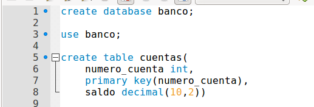
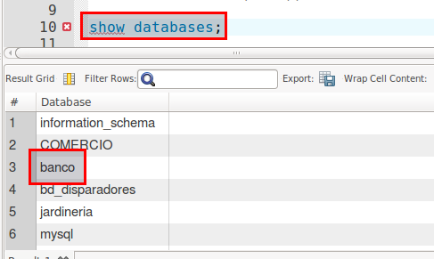
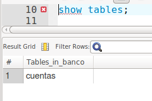
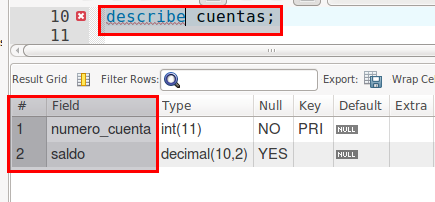
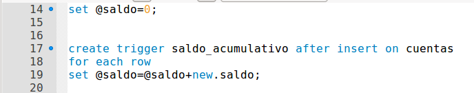
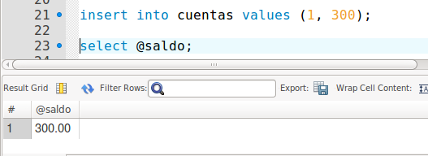
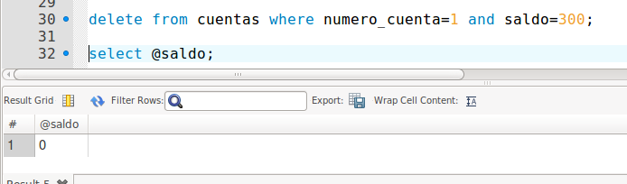

# Triggers en MySQL


## 1. Crear una base de datos llamada Banco. Dentro de Banco, crear una tabla llamada cuentas que va a tener dos campos, número de cuenta (entero y clave primaria) y saldo (10 partes enteras y 2 partes decimales)


Primero tenemos que crear una base de datos que se llame `banco`.

```console

create database banco;

```

Luego creamos la tabla de `cuenta` y dos campos:

- `numero_cuenta`: Entero y Clave primaria.
- `saldo`: 10 partes enteras y 2 decimales.

```console

use banco;

create table cuentas(
	numero_cuenta int,
	primary key(numero_cuenta),
    saldo decimal(10,2))
```



- Comprobamos que tenemos creado la base de datos de `banco`

```console
alu5906@server:~$ mysql -u root -p
Enter password:
Welcome to the MySQL monitor.  Commands end with ; or \g.
Your MySQL connection id is 6
Server version: 5.7.21-0ubuntu0.16.04.1-log (Ubuntu)

Copyright (c) 2000, 2018, Oracle and/or its affiliates. All rights reserved.

Oracle is a registered trademark of Oracle Corporation and/or its
affiliates. Other names may be trademarks of their respective
owners.

Type 'help;' or '\h' for help. Type '\c' to clear the current input statement.

mysql> show databases;
+--------------------+
| Database           |
+--------------------+
| information_schema |
| COMERCIO           |
| banco              |
| bd_disparadores    |
| jardineria         |
| mysql              |
| performance_schema |
| phpmyadmin         |
| prueba             |
| sakila             |
| sys                |
+--------------------+
11 rows in set (0,00 sec)

mysql>
```



- Ahora vamos a comprobar si tenemos la tabla creada `cuentas`

```console

mysql> use banco;
Reading table information for completion of table and column names
You can turn off this feature to get a quicker startup with -A

Database changed
mysql> show tables;
+-----------------+
| Tables_in_banco |
+-----------------+
| cuentas         |
+-----------------+
1 row in set (0,00 sec)

mysql>
```




- Comprobamos que los campos de numero_cuenta y saldo están creados.

```console
mysql> describe cuentas;
+---------------+---------------+------+-----+---------+-------+
| Field         | Type          | Null | Key | Default | Extra |
+---------------+---------------+------+-----+---------+-------+
| numero_cuenta | int(11)       | NO   | PRI | NULL    |       |
| saldo         | decimal(10,2) | YES  |     | NULL    |       |
+---------------+---------------+------+-----+---------+-------+
2 rows in set (0,00 sec)

mysql>
```




## 2. Crear un trigger que guarde en una variable, llamada saldo, el acumulativo de los valores insertados en cada una de las tuplas.

Lo primero que tenemos que realizar es la variable llamada `saldo`.

```console
mysql> set @saldo=0;
Query OK, 0 rows affected (0,00 sec)

mysql>
```

- Tenemos que crear un trigger llamado `saldo_acumulativo`.

```console
mysql> create trigger saldo_acumulativo after insert on cuentas
    -> for each row
    -> set @saldo=@saldo+new.saldo;                                         
Query OK, 0 rows affected (0,00 sec)

mysql>
```

Ya lo tenemos creado el trigger de `saldo_acumulativo`.



Si queremos eliminar un trigger solo tenemos que escribir el siguiente comando.

- `drop trigger saldo_acumulativo;`

## 3. Insertar valores y comprobar el total de saldo insertado con un select.

Vamos a insertar un valor y comprobamos el resultado total de `saldo`.

```console
mysql> insert into cuentas values (1, 300);
Query OK, 1 row affected (5,40 sec)

mysql> select @saldo;
+--------+
| @saldo |
+--------+
| 300.00 |
+--------+
1 row in set (0,00 sec)

mysql>

```




## 4. Crear también un trigger que reste cuando eliminamos una tupla.

Creamos un nuevo trigger en este caso para restar el `saldo` y le vamos a dar de nombre al trigger `disminuir_saldo`.

```console
mysql> create trigger disminuir_saldo after delete on cuentas
    -> for each row
    -> set @saldo=@saldo-old.saldo;
Query OK, 0 rows affected (5,42 sec)

mysql>
```


## 5. Comprobar el total del saldo después de los borrados.

Vamos a realizar una comprobación para ver si resta el `saldo`.

```console
mysql> delete from cuentas where numero_cuenta=1 and saldo=300;
Query OK, 1 row affected (0,01 sec)

mysql> select @saldo;
+--------+
| @saldo |
+--------+
|      0 |
+--------+
1 row in set (0,00 sec)

mysql>
```



## 6. Comprobar los triggers creados.

```console
mysql> show triggers;
+-------------------+--------+---------+-----------------------------+--------+------------------------+-------------------------------------------------------------------------------------------------------------------------------------------+----------------+----------------------+----------------------+--------------------+
| Trigger           | Event  | Table   | Statement                   | Timing | Created                | sql_mode                                                                                                                                  | Definer        | character_set_client | collation_connection | Database Collation |
+-------------------+--------+---------+-----------------------------+--------+------------------------+-------------------------------------------------------------------------------------------------------------------------------------------+----------------+----------------------+----------------------+--------------------+
| saldo_acumulativo | INSERT | cuentas | set @saldo=@saldo+new.saldo | AFTER  | 2018-02-05 21:56:19.71 | ONLY_FULL_GROUP_BY,STRICT_TRANS_TABLES,NO_ZERO_IN_DATE,NO_ZERO_DATE,ERROR_FOR_DIVISION_BY_ZERO,NO_AUTO_CREATE_USER,NO_ENGINE_SUBSTITUTION | root@localhost | utf8                 | utf8_general_ci      | latin1_swedish_ci  |
| disminuir_saldo   | DELETE | cuentas | set @saldo=@saldo-old.saldo | AFTER  | 2018-02-05 22:01:15.89 | ONLY_FULL_GROUP_BY,STRICT_TRANS_TABLES,NO_ZERO_IN_DATE,NO_ZERO_DATE,ERROR_FOR_DIVISION_BY_ZERO,NO_AUTO_CREATE_USER,NO_ENGINE_SUBSTITUTION | root@localhost | utf8                 | utf8_general_ci      | latin1_swedish_ci  |
+-------------------+--------+---------+-----------------------------+--------+------------------------+-------------------------------------------------------------------------------------------------------------------------------------------+----------------+----------------------+----------------------+--------------------+
2 rows in set (0,00 sec)

mysql>
```

## 7. Código completo de la creación de la base de datos, los triggers, los insert y el delete.


```console

create database banco;

use banco;

create table cuentas(
	numero_cuenta int,
	primary key(numero_cuenta),
    saldo decimal(10,2))


set @saldo=0;


create trigger saldo_acumulativo after insert on cuentas
for each row
set @saldo=@saldo+new.saldo;

insert into cuentas values (1, 300);

select @saldo;


create trigger disminuir_saldo after delete on cuentas
for each row
set @saldo=@saldo-old.saldo;

delete from cuentas where numero_cuenta=1 and saldo=300;

select @saldo;

```
